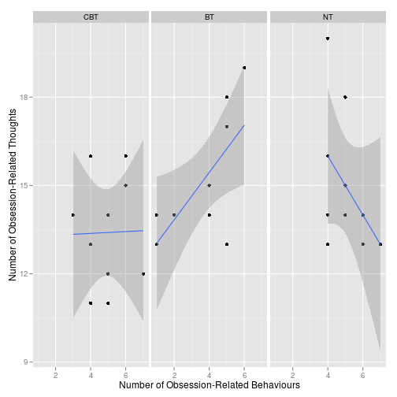
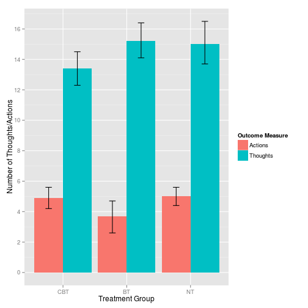
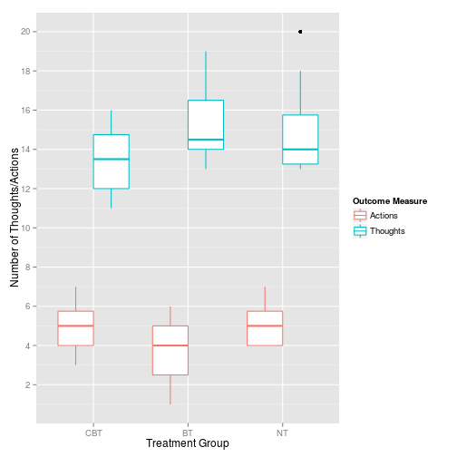
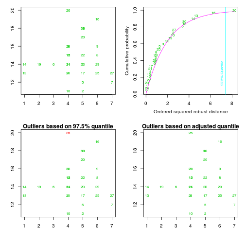

### 1. 다변량 분산분석(MANOVA)란?
범주형 자료로 구성된 독립변수들이 연속형 자료로 구성된 두 개 이상의 종속변수 에 대해 갖는 차이를 검증하고자 할 때 사용하는 통계기법

- 교수방법(질의식/토론식)에 따른 국어성적에 차이가 있는가? : T검정
- 교수방법(질의식/토론식/강연식)에 따른 국어성적에 차이가 있는가? : ANOVA
- 교수방법(질의식/토론식/강연식)에 따른 국어성적과 영어성적 차이가 있는가? : MANOVA

### 2. 다변량 분산분석의 통계적 가설
- ANOVA : 하나 또는 두개 이상의 독립변수에 대해 하나의 종속변수에 대한 모든 집단의 평균이 같다는 영가설을 검증
- MANOVA : 여러 종속변수들의 선형 결합된 평균벡터가 모든 집단에서 같다는 영가설을 검증

**평균벡터의 차이란?**
: 집단 간 평균벡터가 다르다는 것은 여러 종속 측정치의 결합점수가 독립변수에 따라 차이가 있음을 말하는 것이며, 그 차이는  독립변수의 처치효과라고 해석한다.
이것이 곧 독립변수의 주효화가 유의미 하다는 것을 말한다


### 3. ANOVA와 MANOVA의 차이점
1. MANOVA는 종속변수의 조합에 대한 효과의 동시검정을 중요시합니다.    
즉 대부분의 종속변수들은 서로 상관관계가 있기 때문입니다. 
따라서 MANOVA는 ANOVA와는 달리 집단간의 결합된 차이를 밝혀낼 수 있어 집단간의 차이를 밝히는데 사용가능한 정보를 보다 많이 사용할 수 있습니다

2. MANOVA 설계의 특징은 종속변수가 벡터변수라는 점입니다

3. ANOVA로 여러 개의 종속변수를 평가하려면, 여러번의 분석을 해야 하지만, MANOVA는 단 한번의 분석만을 하게 됩니다. 따라서 ANOVA로 분석하게 되면, 1종 오차의 확률이 커집니다.


### 4. MANOVA를 수행하기 위한 가정
1. 관측치가 서로 독립일 것.
2. 각 집단의 분산과 공분산 행렬이 동일할 것.
3. 모든 종속변수들은 다변량 정규분포를 따를 것.

==============================================================================

# R code 실습

### 1. Enter data

```r
#setwd("~/R/psygrammer_statics/aall_data_files")
#Initiate packages
library(Hmisc)
```

```
## Loading required package: grid
## Loading required package: lattice
## Loading required package: survival
## Loading required package: splines
## Loading required package: Formula
## 
## Attaching package: 'Hmisc'
## 
## The following objects are masked from 'package:base':
## 
##     format.pval, round.POSIXt, trunc.POSIXt, units
```

```r
library(car)
library(ggplot2)
library(mvnormtest) ## mshaphiro.test() : Normality
library(mvoutlier) ## aq.plot() : multivariate outliers
```

```
## Loading required package: sgeostat
```

```r
library(pastecs) ## by(), stat.desc() : 
```

```
## Loading required package: boot
## 
## Attaching package: 'boot'
## 
## The following object is masked from 'package:car':
## 
##     logit
## 
## The following object is masked from 'package:survival':
## 
##     aml
## 
## The following object is masked from 'package:lattice':
## 
##     melanoma
```

```r
library(reshape)
library(WRS)
```

```
## Loading required package: MASS
## Loading required package: akima
## Loading required package: robustbase
## 
## Attaching package: 'robustbase'
## 
## The following object is masked from 'package:boot':
## 
##     salinity
## 
## The following object is masked from 'package:survival':
## 
##     heart
## 
## 
## Attaching package: 'WRS'
## 
## The following object is masked from 'package:robustbase':
## 
##     hard.rejection
## 
## The following object is masked from 'package:MASS':
## 
##     ltsreg
## 
## The following object is masked from 'package:car':
## 
##     ellipse
## 
## The following object is masked from 'package:stats':
## 
##     ecdf
## 
## The following object is masked from 'package:grDevices':
## 
##     bmp
```

```r
library(MASS) ## lda()
ocdData <- read.delim("OCD.dat", header = T)
ocdData$Group <- factor(ocdData$Group, levels = c("CBT", "BT", "No Treatment Control"), labels = c("CBT", "BT", "NT"))
str(ocdData)
```

```
## 'data.frame':	30 obs. of  3 variables:
##  $ Group   : Factor w/ 3 levels "CBT","BT","NT": 1 1 1 1 1 1 1 1 1 1 ...
##  $ Actions : int  5 5 4 4 5 3 7 6 6 4 ...
##  $ Thoughts: int  14 11 16 13 12 14 12 15 16 11 ...
```

```r
ocdData
```

```
##    Group Actions Thoughts
## 1    CBT       5       14
## 2    CBT       5       11
## 3    CBT       4       16
## 4    CBT       4       13
## 5    CBT       5       12
## 6    CBT       3       14
## 7    CBT       7       12
## 8    CBT       6       15
## 9    CBT       6       16
## 10   CBT       4       11
## 11    BT       4       14
## 12    BT       4       15
## 13    BT       1       13
## 14    BT       1       14
## 15    BT       4       15
## 16    BT       6       19
## 17    BT       5       13
## 18    BT       5       18
## 19    BT       2       14
## 20    BT       5       17
## 21    NT       4       13
## 22    NT       5       15
## 23    NT       5       14
## 24    NT       4       14
## 25    NT       6       13
## 26    NT       4       20
## 27    NT       7       13
## 28    NT       4       16
## 29    NT       6       14
## 30    NT       5       18
```

### 2. Exploring the data

```r
## Data shape and Covariance

ocdScatter <- ggplot(ocdData, aes(Actions, Thoughts))
ocdScatter + geom_point() + geom_smooth(method = "lm")+ labs(x = "Number of Obsession-Related Behaviours", y = "Number of Obsession-Related Thoughts") + facet_wrap(~Group, ncol = 3)
```

 

```r
ocdMelt<-melt(ocdData, id = c("Group"), measured = c("Actions", "Thoughts"))
names(ocdMelt)<-c("Group", "Outcome_Measure", "Frequency")


ocdBar <- ggplot(ocdMelt, aes(Group, Frequency, fill = Outcome_Measure))
ocdBar + stat_summary(fun.y = mean, geom = "bar", position = "dodge") + stat_summary(fun.data = mean_cl_boot, geom = "errorbar", position=position_dodge(width=0.90), width = 0.2) + labs(x = "Treatment Group", y = "Number of Thoughts/Actions", fill = "Outcome Measure") + scale_y_continuous(breaks = seq(0, 20, by = 2))
```

 

```r
ocdBoxplot <- ggplot(ocdMelt, aes(Group, Frequency, colour = Outcome_Measure))
ocdBoxplot + geom_boxplot() + labs(x = "Treatment Group", y = "Number of Thoughts/Actions", colour = "Outcome Measure") + scale_y_continuous(breaks = seq(0, 20, by = 2))
```

 

```r
options(digits = 3)
by(ocdData$Actions, ocdData$Group, stat.desc, basic = FALSE)
```

```
## ocdData$Group: CBT
##       median         mean      SE.mean CI.mean.0.95          var 
##        5.000        4.900        0.379        0.856        1.433 
##      std.dev     coef.var 
##        1.197        0.244 
## -------------------------------------------------------- 
## ocdData$Group: BT
##       median         mean      SE.mean CI.mean.0.95          var 
##        4.000        3.700        0.559        1.264        3.122 
##      std.dev     coef.var 
##        1.767        0.478 
## -------------------------------------------------------- 
## ocdData$Group: NT
##       median         mean      SE.mean CI.mean.0.95          var 
##        5.000        5.000        0.333        0.754        1.111 
##      std.dev     coef.var 
##        1.054        0.211
```

```r
by(ocdData$Thoughts, ocdData$Group, stat.desc, basic = FALSE)
```

```
## ocdData$Group: CBT
##       median         mean      SE.mean CI.mean.0.95          var 
##       13.500       13.400        0.600        1.357        3.600 
##      std.dev     coef.var 
##        1.897        0.142 
## -------------------------------------------------------- 
## ocdData$Group: BT
##       median         mean      SE.mean CI.mean.0.95          var 
##       14.500       15.200        0.663        1.501        4.400 
##      std.dev     coef.var 
##        2.098        0.138 
## -------------------------------------------------------- 
## ocdData$Group: NT
##       median         mean      SE.mean CI.mean.0.95          var 
##       14.000       15.000        0.745        1.686        5.556 
##      std.dev     coef.var 
##        2.357        0.157
```

```r
options(digits = 7)


by(ocdData[, 2:3], ocdData$Group, cov)
```

```
## ocdData$Group: CBT
##             Actions   Thoughts
## Actions  1.43333333 0.04444444
## Thoughts 0.04444444 3.60000000
## -------------------------------------------------------- 
## ocdData$Group: BT
##           Actions Thoughts
## Actions  3.122222 2.511111
## Thoughts 2.511111 4.400000
## -------------------------------------------------------- 
## ocdData$Group: NT
##            Actions  Thoughts
## Actions   1.111111 -1.111111
## Thoughts -1.111111  5.555556
```

```r
## Normality

cbt<-t(ocdData[1:10, 2:3])
bt<-t(ocdData[11:20, 2:3])
nt<-t(ocdData[21:30, 2:3])

mshapiro.test(cbt)
```

```
## 
## 	Shapiro-Wilk normality test
## 
## data:  Z
## W = 0.9592, p-value = 0.7767
```

```r
mshapiro.test(bt)
```

```
## 
## 	Shapiro-Wilk normality test
## 
## data:  Z
## W = 0.8912, p-value = 0.175
```

```r
mshapiro.test(nt)
```

```
## 
## 	Shapiro-Wilk normality test
## 
## data:  Z
## W = 0.826, p-value = 0.02998
```

```r
aq.plot(ocdData[, 2:3])
```

 

```
## $outliers
##  [1] FALSE FALSE FALSE FALSE FALSE FALSE FALSE FALSE FALSE FALSE FALSE
## [12] FALSE FALSE FALSE FALSE FALSE FALSE FALSE FALSE FALSE FALSE FALSE
## [23] FALSE FALSE FALSE FALSE FALSE FALSE FALSE FALSE
```


### 3. Setting contrasts

```r
CBT_vs_NT<-c(1, 0, 0)
BT_vs_NT <-c(0, 1, 0)
contrasts(ocdData$Group)<-cbind(CBT_vs_NT, BT_vs_NT)

#contrasts(ocdData$Group)<-contr.treatment(3, base = 3)
```


### 4. Main analysis

```r
outcome<-cbind(ocdData$Actions, ocdData$Thoughts)
ocdModel<-manova(outcome ~ Group, data = ocdData)
summary(ocdModel, intercept = TRUE)
```

```
##             Df  Pillai approx F num Df den Df  Pr(>F)    
## (Intercept)  1 0.98285   745.23      2     26 < 2e-16 ***
## Group        2 0.31845     2.56      4     54 0.04904 *  
## Residuals   27                                           
## ---
## Signif. codes:  0 '***' 0.001 '**' 0.01 '*' 0.05 '.' 0.1 ' ' 1
```

```r
summary(ocdModel, intercept = TRUE, test = "Wilks")
```

```
##             Df   Wilks approx F num Df den Df  Pr(>F)    
## (Intercept)  1 0.01715   745.23      2     26 < 2e-16 ***
## Group        2 0.69851     2.55      4     52 0.04966 *  
## Residuals   27                                           
## ---
## Signif. codes:  0 '***' 0.001 '**' 0.01 '*' 0.05 '.' 0.1 ' ' 1
```

```r
summary(ocdModel, intercept = TRUE, test = "Hotelling")
```

```
##             Df Hotelling-Lawley approx F num Df den Df Pr(>F)    
## (Intercept)  1           57.325   745.23      2     26 <2e-16 ***
## Group        2            0.407     2.55      4     50 0.0508 .  
## Residuals   27                                                   
## ---
## Signif. codes:  0 '***' 0.001 '**' 0.01 '*' 0.05 '.' 0.1 ' ' 1
```

```r
summary(ocdModel, intercept = TRUE, test = "Roy")
```

```
##             Df    Roy approx F num Df den Df  Pr(>F)    
## (Intercept)  1 57.325   745.23      2     26 < 2e-16 ***
## Group        2  0.335     4.52      2     27 0.02027 *  
## Residuals   27                                          
## ---
## Signif. codes:  0 '***' 0.001 '**' 0.01 '*' 0.05 '.' 0.1 ' ' 1
```


### 5. Discriminant Analysis

```r
ocdDFA<-lda(Group ~ Actions + Thoughts, data = ocdData, na.action="na.omit")
summary(ocdDFA)
```

```
##         Length Class  Mode     
## prior   3      -none- numeric  
## counts  3      -none- numeric  
## means   6      -none- numeric  
## scaling 4      -none- numeric  
## lev     3      -none- character
## svd     2      -none- numeric  
## N       1      -none- numeric  
## call    4      -none- call     
## terms   3      terms  call     
## xlevels 0      -none- list
```

```r
plot(ocdDFA)
```

 

```r
predict(ocdDFA)
```

```
## $class
##  [1] CBT CBT BT  CBT CBT BT  CBT NT  NT  CBT BT  BT  BT  BT  BT  NT  CBT
## [18] NT  BT  NT  CBT NT  CBT BT  CBT BT  CBT BT  CBT NT 
## Levels: CBT BT NT
## 
## $posterior
##           CBT         BT         NT
## 1  0.41003807 0.20900180 0.38096014
## 2  0.69524689 0.08419665 0.22055645
## 3  0.17211521 0.48774998 0.34013480
## 4  0.42588147 0.28674555 0.28737297
## 5  0.60627836 0.11854535 0.27517628
## 6  0.23139297 0.53648006 0.23212696
## 7  0.68336616 0.02937571 0.28725813
## 8  0.37521807 0.14478631 0.47999563
## 9  0.28958032 0.18041368 0.53000600
## 10 0.62975350 0.16265415 0.20759235
## 11 0.32759970 0.35612965 0.31627065
## 12 0.24175420 0.42432180 0.33392400
## 13 0.12064555 0.78801706 0.09133739
## 14 0.07918282 0.83504896 0.08576823
## 15 0.24175420 0.42432180 0.33392400
## 16 0.11132764 0.29192650 0.59674586
## 17 0.50888684 0.16065357 0.33045959
## 18 0.11966256 0.41448699 0.46585045
## 19 0.14312032 0.70769071 0.14918898
## 20 0.17046380 0.36570263 0.46383356
## 21 0.42588147 0.28674555 0.28737297
## 22 0.31723490 0.26107392 0.42169119
## 23 0.41003807 0.20900180 0.38096014
## 24 0.32759970 0.35612965 0.31627065
## 25 0.56402799 0.08348934 0.35248267
## 26 0.03504054 0.67480082 0.29015864
## 27 0.59850707 0.04153946 0.35995347
## 28 0.17211521 0.48774998 0.34013480
## 29 0.46879841 0.11204002 0.41916157
## 30 0.11966256 0.41448699 0.46585045
## 
## $x
##           LD1         LD2
## 1   0.4602010 -0.01736741
## 2   1.4659443  1.00042182
## 3  -0.8132992 -0.27094845
## 4   0.1924441  0.74684078
## 5   1.1306965  0.66115874
## 6  -0.7458083  0.83252282
## 7   2.3367058 -0.18873149
## 8   0.7279579 -0.78157561
## 9   0.3927101 -1.12083868
## 10  0.8629396  1.42536694
## 11 -0.1428037  0.40757770
## 12 -0.4780514  0.06831463
## 13 -1.6165699  2.02167613
## 14 -1.9518176  1.68241305
## 15 -0.4780514  0.06831463
## 16 -0.6130332 -2.13862792
## 17  0.7954487  0.32189566
## 18 -0.8807901 -1.37441972
## 19 -1.3488130  1.25746794
## 20 -0.5455423 -1.03515665
## 21  0.1924441  0.74684078
## 22  0.1249532 -0.35663049
## 23  0.4602010 -0.01736741
## 24 -0.1428037  0.40757770
## 25  1.3984534 -0.10304945
## 26 -2.1542903 -1.62800076
## 27  2.0014580 -0.52799457
## 28 -0.8132992 -0.27094845
## 29  1.0632056 -0.44231253
## 30 -0.8807901 -1.37441972
```

