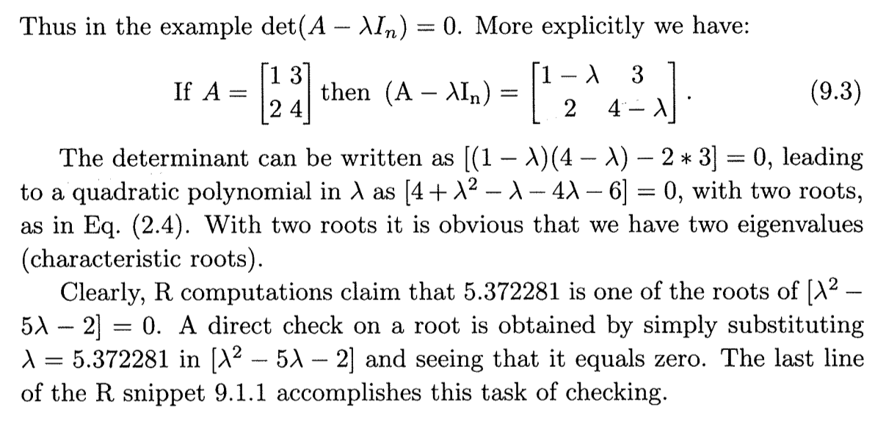

Chapter 9. Eigenvalues and Eigenvectors
========================================================

* 발제 : 김무성
* 참고문헌 :  Hands-On Matrix Algebra Using R: Active and Motivated Learning with Applications / Hrishikesh D Vinod 

# 9.1 Characteristic Equation

### R program snippet 9.1.1
```{r}
A = matrix(1:4,2); A #view A
ea = eigen(A) # object ea contains eigenvalues-vectors of A
ea
lam = ea$val[1]; lam #view lambda
x = ea$vec[,1]; x # view x
lam*diag(2)
det(A-lam*diag(2)) # should be zero
sqrt(sum(x^2)) # Eculidean length of x is 1
lam^2-5*lam # solving quadratic OK if this is 2
```

### R program snippet 9.1.1 설명


# 9.2 Eigenvalues and Eigenvectors of Correlation Matrix

### R program snippet 9.1.1
```{r}
set.seed(93); x = matrix(sample(1:90), 10, 3)
x
A = cor(x); A # corrlation matrix for columns of x
x[2,1] = NA # insert missing data in column 1
x
x[1,3] = NA # insert missing data in cloumn 3
x
library(Hmisc) # bring Hmisc package into R memory
rcorr(x) # produces 3 matrices
```


