Chapter 19. Multilevel linear models
========================================================

* 발제 : 김무성

# contents

* 19.1. What will this chapter tell me?
* 19.2. Hierarchical data
* 19.3. Theory of multilevel linear models
* 19.4. The multilevel model
* 19.5. Some practical issues
* 19.6. Multilevel modeling in R
* 19.7. Growth models
* 19.8. How to report a multilevel model

-----------------------------------------

# 19.1. What will this chapter tell me?

-----------------------------------------

# 19.2. Hierarchical data

* 19.2.1. The intraclass correlation
* 19.2.2. Benefits of multilevel models

* keywords

 - hierarchy
 - level
 - contextual variables


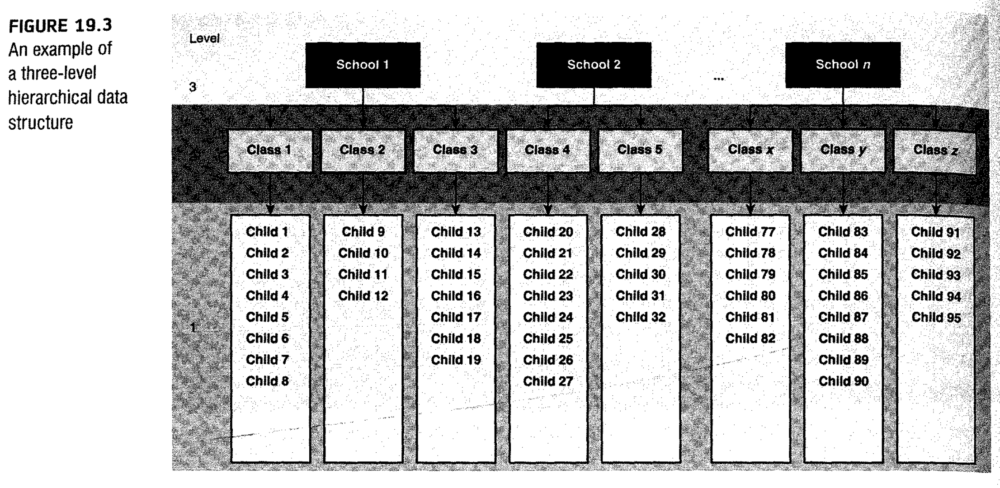


## 19.2.1. The intraclass correlation

* intraclass correlation(ICC) : a good gauge of whter a contextual variable has an effect on the outcome.
* The ICC tells us that variability 
  - within levels of a contextual variable (in this case the clas to which a child belongs) is small,
  - but between levels of a contextual variable (comparing class) is large. 

## 19.2.2. Benefits of multilevel models

* Cast aside the assumptin of homogeneity of regression slope.
 - ch11. analysis of covariance : different groups, same relationship between covariate and outcome
* Say 'bye bye' to the assumption of independence.
 - ch10. independent ANOVA : different cases of data are independent.
 - ch7. multiple regression : independent observations
* Laugh in the face of missing data.
 - Regression, ANOVA, ANCOVA and etc .. : balanced designs and not have missing data

-----------------------------------------

# 19.3. Theory of multilevel linear models

* 19.3.1. An example
* 19.3.2. Fixed and random coefficients
 * 19.3.2.1. The random intercept model
 * 19.3.2.2. Random slope model
 * 19.3.3.3. The random intercept and slope model

* keywords
 - very complicated
 - use R : lme()
 
-----------------------------------------

## 19.3.1. An example

 * The effects of cosmetric Sugery on quality of life
 * repeated-measures design.
 * 2 level
 * Cosmetic Surgery.dat
    * Post_QoL : This is a measure of quality of life after the cosmetic surgery. This is our
outcome variable.
    * Base_QoL : We need to adjust our outcome for quality of life before the surgery.
    * Surgery : This variable is a dummy variable that specifies whether the person has
undergone cosmetic surgery (1) or whether they are on the waiting list (0), which acts as our control group.
    * Surgery_Text : This variable is the same as above but specifies group membership as
text (we will use this variable when we create graphs but not for the main analysis).
    * Clinic : This variable specifies which of 10 clinics the person attended to have their
surgery.
    * Age : This variable tells us the person’ s age in years.
    * BDI : It is becoming increasingly apparent that people volunteering for cosmetic surgery (especially when the surgery is purely for vanity) might have very different personality profiles than the general public (Cook, Rossera, Toone , James, & Salmon,2006). In particular, these people might have low self-esteem or be depressed. When looking at quality of life it is important to assess naturallevels of depression , and this variable used the Beck Depression Inventory (BDI) to do just that.
    * Reason : This dummy variable specifies whether the person had/is waiting to have surgery purely to change their appearance (0) , or because of a physical reason (1).
    * Reason_Text : This variable is the same as above but contains text to define each group rather than a number.
    * Gender : This variable simply specifies whether the person was a man (1) or a woman (0).    
 


## 19.3.2. Fixed and random coefficients

* 19.3.2.1. The random intercept model
* 19.3.2.2. Random slope model
* 19.3.3.3. The random intercept and slope model 

* keywords
 - fixed effects : An
effect in an experiment is said to be a fixed effect if all possible treatment conditions that
a researcher is interested in are present in the experiment.fixed effects can be generalized only to the situations in your experiment.
 - random effects : An effect is said to be random if the experiment contains only a random sample of possible treatment conditions. random effects can be generalized beyond the treatment conditions in the experiment (provided that the treatment conditions are representative).
 - fixed variables : A fixed variable is one that is not supposed to change over time.
 - random variables : whereas a random one varies over time.
 - fixed coefficients : In the regressions , ANOVAs and ANCOVAs throughout this
book we have assumed that the regression parameters are fixed.
 - random coefficients 
 - fixed intercepts 
 - fixed slopes
 - random intercepts 
 - random slopes
 


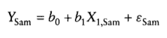


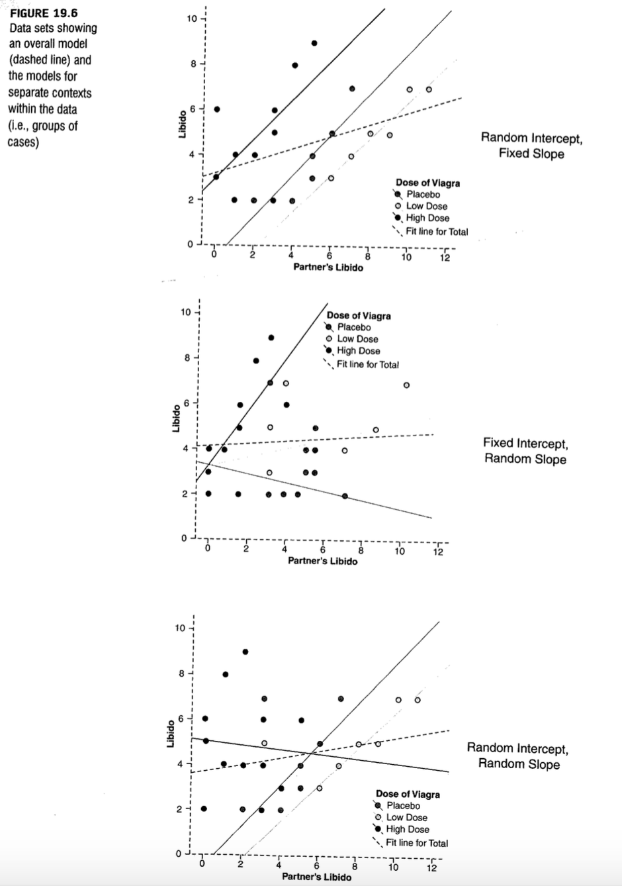


### 19.3.2.1, The random intercept model

### 19.3.2.2, The random slope model

### 19.3.2.1, The random intercept and slope model


-----------------------------------------

# 19.4. The multilevel model

* 19.4.1. Accessing the fit the fit and comparing multilevel models
* 19.4.2. Type of covariacne structures

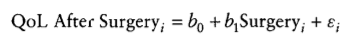


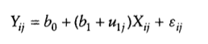

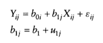

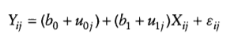


## 19.4.1. Accessing the fit the fit and comparing multilevel models

* chi-square likelihood
* -2LL : -2log-likelihood
* AIC : Akaike's informatioη criterioη. This is basically a goodness-of-fit measure that is corrected for model complexity. That just means that it takes into account how many
parameters have been estimated .
* BIC : Schtνarz's Bayesian criterioη. This statistic is comparable to the AIC , although it is slightly more conservative (it corrects more harshly for the number of parameters being estimated). It should be used when sample sizes are large and the number of parameters is small.

* Recommed !!
  * Many writers recommend building up multilevel models starting with a ‘basic’ model in
which all parameters are fixed and then adding in random coefficients as appropriate and
exploring confounding variables (Raudenbush & Bryk, 2002; Twisk , 2006).
  
  


## 19.4.2. Type of covariacne structures

* covariance structures
* If you have random effects
and repeated measures then you can specify different covariance structures for each.
* The covariance structure simply specifies the form of the variance-covariance matrix (a matrix in which the diagonal elements are variances and the off-diagonal elements are covariances)
* Of course we might not know what form it takes (most of the time we’ll be taking an educated guess) , so it is sometimes useful to run the model with different covariance structures defined and use the goodness-of-fit indices (the AIC and BIC) to see whether changing the covariance structure improves the fit of the model (remember that a sma11er value of these statistics means a better-fitting model)

* types
  * Variance components
  
  
  
  * Diagonal
  
  
  
  * AR(1)
  
  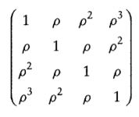
  
  * Unstructured
  
  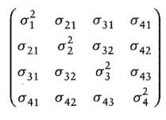

  


-----------------------------------------

# 19.5. Some practical issues

* 19.5.1. Assumptions
* 19.5.2. Sample size and power
* 19.5.3. Centring variables

## 19.5.1. Assumptions

* Multilevellinear models are an extension of regression , so all of the assumptions for regres-
sion apply to multilevel models
* There are two additional assumptions in multilevel models that relate to the random
coefficients.These coefficients are assumed to be normally distributed around the overall
model.
  * So,in a random intercepts model the intercepts in the different contexts are assumed
to be normally distributed around the overall model.
  * Similarly, in a random slopes model, the slopes of the models in different contexts are assumed to be normally distributed.


## 19.5.2. Sample size and power

* As you might well imagine, the situation with power and sample size is very complex
indeed. 
  * As more levels are introduced into the model , more parameters need to be esti-
mated and the larger the sample sizes need to be.
  * Kreft and de Leeuw (1998), they conclude by saying that there are so many factors involved in multilevel analysis that it is impossible to produce any meaningful rules of thumb.
  * Twisk (2006) agrees that the number of contexts relative to individuals within those
contexts is important. He also points out that standard sample size and power calculations
can be used but then ‘ corrected ’ for the multilevel component of the analysis (by factoring , among other things , the intraclass correlation). However, there are two corrections that he discusses that yield very different sample sizes! He recommends using sample size calculations with caution.

## 19.5.3. Centring variables

 * Centring : Centring refers to the process of transforming a variable into deviations
around a fixed point. This fixed point can be any value that you choose ,
but typically we use the grand mean. 
 * There are two forms of centring that are typically used in multilevel modelling
   * grand centring : Grand mean centring means that for a given vari-
able we take each score and subtract from it the mean of all scores (for that variable).
   * group mean centring : Group mean centring means that for a given variable we take each score and subtract from it the mean of the scores (for that variable) within a given group.
   * In more general terms , if all predictors are centred around their mean then the intercept is the value of the outcome when all predictors are the value of their mean. Centring can, therefore , be a useful tool for interpretation when a value of 0 for the predictor is meaningless.
   * The effect of centring in multilevel models , however, is much more complicated.
   * Therefore, grand mean centring doesn ’ t change the model , but it would change your interpretation of the parameters (you can't interpret them as though they are raw scores). When group mean centring is used the picture is much more complicated. In this situation the raw score model is not equivalent to the centred model in either the fixed part or the random part. One exception is when only the intercept is random (which arguably is an unusual situation) , and the group means are reintroduced into the model as level2 variables (Kreft & de Leeuw, 1998).
   * The decision about whether to centre or not is quite complicated and you really need
to make the decision yourself in a given analysis. Centring can be a useful way to combat 
multicollinearity between predictor variables. It’ s also helpful when predictors do not have a meaningful zero point. Finally, multilevel models with centred predictors tend to be more stable, and estimates from these models can be treated as more or less independent of each other, which might be desirable.
   * The question arises of whether grand mean or group mean centring is ‘ better ’.
   * In short, they make four recommendations when analysing data with a two-level
hierarchy: 
   * (1) group mean clustering should be used if the primary interest is in an association between variables measured at level 1 (i.e., the aforementioned relationship between surgery and quality of life after surgery)
   * (2) grand mean centring is appropriate when the primary interest is in the level 2 variable but you want to control for the level 1 covariate (i.e. , you want to look at the effect of clinic on quality of life after surgery while controlling for the type of surgery)
   * (3) both types of centring can be used to look at the differential influence of a variable at level 1 and 2 (i.e. , is the effect of surgery on quality of life post-surgery different at the clinic level to the client level?)
   * (4) group mean centring is preferable for examining cross-level interactions (e.g. , the interactive effect of clinic and surgery on quality of life after surgery).

   


-----------------------------------------

# 19.6. Multilevel modelling in R

* 19.6.1. Packages for multilevel modelling in R
* 19.6.2. Entering the data
* 19.6.3. Picturing the data
* 19.6.4. Ignoring the data structure: ANOVA
* 19.6.5. Ignoring the data structure : ANCOVA
* 19.6.6. Assessing the need for a multilevel model
* 19.6.7. Adding in fixed effects
* 19.6.8. Introducing random slopes
* 19.6.9. Adding an interaction term to the model

## 19.6.1. Packages for multilevel modelling in R

```{r}
#install.packages("car")
#install.packages("nlme") # non liηear mixed effect
#install.packages("reshape")

library(car)
library(nlme)
library(ggplot2)
library(reshape)
```

## 19.6.2. Entering the data

```{r}
##Load the data file into R. This is a tab-delimited file hence use of read.delim
surgeryData = read.delim("./data/Cosmetic Surgery.dat",  header = TRUE)
head(surgeryData)
str(surgeryData)
summary(surgeryData)
```

## 19.6.3. Picturing the data

```{r, fig.width=10}
#Graph the data
pgrid <- ggplot(surgeryData, aes(Base_QoL, Post_QoL)) + labs(title="Quality of Life Pre-Post Surgery at 10 Clinics")
pgrid + geom_point(aes(colour = Surgery_Text)) + geom_smooth(aes(colour = Surgery_Text), method = "lm", se = F) + facet_wrap(~Clinic, ncol = 5) + labs(x = "Quality of Life (Baseline)", y = "Quality of Life (After Surgery)")
```

## 19.6.4. Ignoring the data structure : ANOVA

```{r}
#Run an ANOVA
surgeryANOVA<-aov(Post_QoL~Surgery, data = surgeryData)
summary(surgeryANOVA)
```

```{r}
# run the same model but using the linear models command
surgeryLinearModel<-lm(Post_QoL~Surgery, data = surgeryData)
summary(surgeryLinearModel)
```

Output 19.2 shows the main table for the model. Compare this table with Output 19.1 and you ’ll see that there is basica11y no difference: we get a non-significant effect of surgery with an F of 0.33 , and a p of .56. The point 1 want you to absorb here is that if we ignore
the hierarchical structure of the data then what we are left with is something very familiar:an ANOVA/regression. The numbers are more or less exactly the same;


### 19.6.5. Ignoring the data structure : ANCOVA

```{r}
#Run an ANCOVA
surgeryANCOVA<-aov(Post_QoL~Base_QoL + Surgery, data = surgeryData)
summary(surgeryANCOVA)
Anova(surgeryANCOVA, type = "III")
```

```{r}
# run the same model but using the linear models command
surgeryLinearModel<-lm(Post_QoL~Surgery + Base_QoL, data = surgeryData)
summary(surgeryLinearModel)
```

## 19.6.6. Assessing the need for a multilevel model

```{r}
##Fit baseline models
#Fit model with intercept only
interceptOnly <-gls(Post_QoL~1, data = surgeryData, method = "ML")
summary(interceptOnly)
#Fit model allowing intercepts to vary by clinic
randomInterceptOnly <-lme(Post_QoL~1, data = surgeryData, random = ~1|Clinic, method = "ML")
summary(randomInterceptOnly)
```

```{r}
logLik(interceptOnly)*-2
logLik(randomInterceptOnly)*-2
anova(interceptOnly, randomInterceptOnly)
```

## 19.6.7. Adding in fixed effects

```{r}
#Add surgery as a predictor
randomInterceptSurgery <-lme(Post_QoL~Surgery, data = surgeryData, random = ~1|Clinic, method = "ML")
summary(randomInterceptSurgery)
```

```{r}
##Fit effect of surgery and baseline QoL- random intercepts across clinics
randomInterceptSurgeryQoL <-lme(Post_QoL~Surgery + Base_QoL, data = surgeryData, random = ~1|Clinic, method = "ML")
summary(randomInterceptSurgeryQoL)
```

```{r}
anova(randomInterceptOnly, randomInterceptSurgery, randomInterceptSurgeryQoL)
```

## 19.6.8. Introducting random slopes

```{r}
##Fit effect of surgery and baseline QoL- random slopes and intercepts across clinics
addRandomSlope<-lme(Post_QoL~Surgery + Base_QoL, data = surgeryData, random = ~Surgery|Clinic, method = "ML")
summary(addRandomSlope)
anova(randomInterceptSurgeryQoL,addRandomSlope)

plot(addRandomSlope)
```

```{r}
##Fit effect of surgery and baseline QoL, Reason and Reason*Surgery Interaction- random slopes and intercepts across clinics

addReason<-lme(Post_QoL~Surgery + Base_QoL + Reason, data = surgeryData, random = ~Surgery|Clinic, method = "ML")
addReason<-update(addRandomSlope, .~. + Reason)
summary(addReason)

finalModel<-lme(Post_QoL~Surgery + Base_QoL + Reason + Reason:Surgery, data = surgeryData, random = ~Surgery|Clinic, method = "ML")
summary(finalModel)
intervals(finalModel, 0.95)

anova(addRandomSlope, addReason, finalModel)

##Fit effect of surgery and baseline QoL seperately for the two Reason groups.

physicalSubset<- surgeryData$Reason==1 
cosmeticSubset<-surgeryData$Reason==0
print(surgeryData$Surgery);print(physicalSubset);print(cosmeticSubset)

physicalModel<-lme(Post_QoL~Surgery + Base_QoL, data = surgeryData, random = ~Surgery|Clinic, subset= physicalSubset, method = "ML")
cosmeticModel<-lme(Post_QoL~Surgery + Base_QoL, data = surgeryData, random = ~Surgery|Clinic, subset= cosmeticSubset, method = "ML")
summary(physicalModel)
summary(cosmeticModel)
```

-----------------------------------------

# 19.7. Growth models

* 19.7.1. Growth curves (polynomials)
* 19.7.2. An example: the honymoon period
* 19.7.3. Restructuring the data
* 19.7.4. Setting up the basic model
* 19.7.5. Adding in time as a fixed effect
* 19.7.6. Introducting random slopes
* 19.7.7. Modelling the covariance structure
* 19.7.8. Camparing models
* 19.7.9. Adding higher-order polynomials
* 19.7.10. Further analysis

"Growth models are extremely important in many areas of science, including psychology, medicine , physics, chemistry and economics. In a growth model the aim is to look at the rate of change of a variable over time: for example, we could look at white blood cell counts, attitudes, radioactive decay or profits. In all cases we’re trying to see which model best describes the change over time."

## 19.7.1. Growth curves (polynomials)


* polynomials
 * first-order (1)
 * second-order (2)
 * third-order (3)
 * nth-order (n) ??

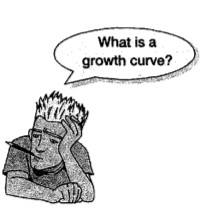

## 19.7.2. An example : the honeymoon period

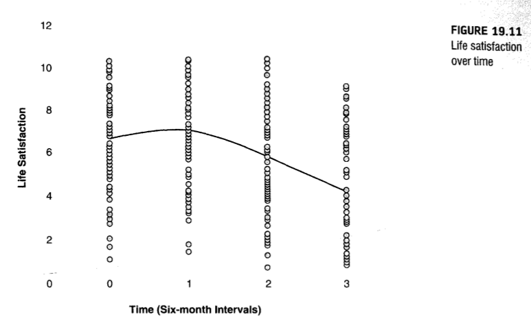

```{r}
#GROWTH MODELS
satisfactionData = read.delim("./data/Honeymoon Period.dat",  header = TRUE)
head(satisfactionData)
str(satisfactionData)
summary(satisfactionData)
```


## 19.7.3. Restructuring the data

* wide format(for ANOVA) -> long format(for multilevel)

```{r}
restructuredData<-reshape(satisfactionData, idvar = c("Person", "Gender"), varying = c("Satisfaction_Base", "Satisfaction_6_Months", "Satisfaction_12_Months", "Satisfaction_18_Months"), v.names="Life_Satisfaction", timevar="Time", times=c(0:3), direction="long")
head(restructuredData)
str(restructuredData)
summary(restructuredData)
```


## 19.7.4. Setting up the basic model

```{r}
intercept <-gls(Life_Satisfaction~1, data = restructuredData, method = "ML", na.action = na.exclude)
```

```{r}
randomIntercept <-lme(Life_Satisfaction ~1, data = restructuredData, random = ~1|Person, method = "ML",  na.action = na.exclude, control = list(opt="optim"))
```

```{r}
anova(intercept, randomIntercept)
```

## 19.7.5 Adding in time as a fixed effect

```{r}
timeRI<-update(randomIntercept, .~. + Time)
```

* .~. = "keep the previous outcome and all of the previous predictors"


```{r}
summary(timeRI)
```


## 19.7.6. Introducting random slopes

```{r}
timeRS<-update(timeRI, random = ~Time|Person)
summary(timeRS )
```

## 19.7.7. Modeling the covariance structure

 * corAR1() : first-order autoregressive covariance structure
 * corCAR1() : This is a simmilar to the above but for use with a continuous time covariate.
 * corARMA() : Another autoregressive error structure, but this one allow the correlation structure to involve a moving average of error variance.

```{r}
ARModel<-update(timeRS, correlation = corAR1(0, form = ~Time|Person))
```

## 19.7.8. Comparing models

 * (1) baseline model : intercept
 * (2) random intercepts across people : randomIntercept
 * (3) a model with time as a predictor of life satisfaction and random intercepts across people : timeRI
 * (4) a model with time as a predictor, a random effect of time over people and random intercepts : timeRS
 * (5) a model with time as a predictor, random effects of time across people , a random effect of intercepts across people, and a first-order autoregressive covariance structure : ARModel


```{r}
anova(intercept, randomIntercept, timeRI, timeRS, ARModel)
```

```{r}
summary(ARModel)
intervals(ARModel)
```

```{r}
plot(ARModel)
plot(ARModel, Life_Satisfaction ~ Time)
```

## 19.7.9. Adding higher-order polynomials

```{r}
timeQuadratic<-update(ARModel, .~. + I(Time^2))
timeCubic <-update(timeQuadratic, .~. + I(Time^3))
anova(ARModel, timeQuadratic, timeCubic)
summary(timeCubic)
intervals(timeCubic)
```


## 19.7.10 Further analysis


-----------------------------------------

# 19.8. How to report a multilevel model


