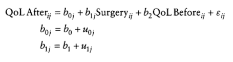

Chapter 19. Multilevel linear models
========================================================

* 발제 : 김무성

# contents

* 19.1. What will this chapter tell me?
* 19.2. Hierarchical data
* 19.3. Theory of multilevel linear models
* 19.4. The multilevel model
* 19.5. Some practical issues
* 19.6. Multilevel modeling in R
* 19.7. Growth models
* 19.8. How to report a multilevel model

-----------------------------------------

# 19.1. What will this chapter tell me?

-----------------------------------------

# 19.2. Hierarchical data

* 19.2.1. The intraclass correlation
* 19.2.2. Benefits of multilevel models

* keywords

 - hierarchy
 - level
 - contextual variables


## 19.2.1. The intraclass correlation

* intraclass correlation(ICC) : a good gauge of whter a contextual variable has an effect on the outcome.
* The ICC tells us that variability 
  - within levels of a contextual variable (in this case the clas to which a child belongs) is small,
  - but between levels of a contextual variable (comparing class) is large. 

## 19.2.2. Benefits of multilevel models

* Cast aside the assumptin of homogeneity of regression slope.
 - ch11. analysis of covariance : different groups, same relationship between covariate and outcome
* Say 'bye bye' to the assumption of independence.
 - ch10. independent ANOVA : different cases of data are independent.
 - ch7. multiple regression : independent observations
* Laugh in the face of missing data.
 - Regression, ANOVA, ANCOVA and etc .. : balanced designs and not have missing data

-----------------------------------------

# 19.3. Theory of multilevel linear models

* 19.3.1. An example
* 19.3.2. Fixed and random coefficients
 * 19.3.2.1. The random intercept model
 * 19.3.2.2. Random slope model
 * 19.3.3.3. The random intercept and slope model

* keywords
 - very complicated
 - use R : lme()
 
-----------------------------------------

## 19.3.1. An example

 * The effects of cosmetric Sugery on quality of life
 * repeated-measures design.
 * 2 level
 * Cosmetic Surgery.dat
    * Post_QoL : This is a measure of quality of life after the cosmetic surgery. This is our
outcome variable.
    * Base_QoL : We need to adjust our outcome for quality of life before the surgery.
    * Surgery : This variable is a dummy variable that specifies whether the person has
undergone cosmetic surgery (1) or whether they are on the waiting list (0), which acts as our control group.
    * Surgery_Text : This variable is the same as above but specifies group membership as
text (we will use this variable when we create graphs but not for the main analysis).
    * Clinic : This variable specifies which of 10 clinics the person attended to have their
surgery.
    * Age : This variable tells us the person’ s age in years.
    * BDI : It is becoming increasingly apparent that people volunteering for cosmetic surgery (especially when the surgery is purely for vanity) might have very different personality profiles than the general public (Cook, Rossera, Toone , James, & Salmon,2006). In particular, these people might have low self-esteem or be depressed. When looking at quality of life it is important to assess naturallevels of depression , and this variable used the Beck Depression Inventory (BDI) to do just that.
    * Reason : This dummy variable specifies whether the person had/is waiting to have surgery purely to change their appearance (0) , or because of a physical reason (1).
    * Reason_Text : This variable is the same as above but contains text to define each group rather than a number.
    * Gender : This variable simply specifies whether the person was a man (1) or a woman (0).    
 


## 19.3.2. Fixed and random coefficients

* 19.3.2.1. The random intercept model
* 19.3.2.2. Random slope model
* 19.3.3.3. The random intercept and slope model 

* keywords
 - fixed effects : An
effect in an experiment is said to be a fixed effect if all possible treatment conditions that
a researcher is interested in are present in the experiment.fixed effects can be generalized only to the situations in your experiment.
 - random effects : An effect is said to be random if the experiment contains only a random sample of possible treatment conditions. random effects can be generalized beyond the treatment conditions in the experiment (provided that the treatment conditions are representative).
 - fixed variables : A fixed variable is one that is not supposed to change over time.
 - random variables : whereas a random one varies over time.
 - fixed coefficients : In the regressions , ANOVAs and ANCOVAs throughout this
book we have assumed that the regression parameters are fixed.
 - random coefficients 
 - fixed intercepts 
 - fixed slopes
 - random intercepts 
 - random slopes
 


### 19.3.2.1, The random intercept model

### 19.3.2.2, The random slope model

### 19.3.2.1, The random intercept and slope model


-----------------------------------------

# 19.4. The multilevel model

* 19.4.1. Accessing the fit the fit and comparing multilevel models
* 19.4.2. Type of covariacne structures





## 19.4.1. Accessing the fit the fit and comparing multilevel models

* chi-square likelihood
* -2LL : -2log-likelihood
* AIC : Akaike's informatioη criterioη. This is basically a goodness-of-fit measure that is corrected for model complexity. That just means that it takes into account how many
parameters have been estimated .
* BIC : Schtνarz's Bayesian criterioη. This statistic is comparable to the AIC , although it is slightly more conservative (it corrects more harshly for the number of parameters being estimated). It should be used when sample sizes are large and the number of parameters is small.

* Recommed !!
  * Many writers recommend building up multilevel models starting with a ‘basic’ model in
which all parameters are fixed and then adding in random coefficients as appropriate and
exploring confounding variables (Raudenbush & Bryk, 2002; Twisk , 2006).
  
  


## 19.4.2. Type of covariacne structures

* covariance structures
* If you have random effects
and repeated measures then you can specify different covariance structures for each.
* The covariance structure simply specifies the form of the variance-covariance matrix (a matrix in which the diagonal elements are variances and the off-diagonal elements are covariances)
* Of course we might not know what form it takes (most of the time we’ll be taking an educated guess) , so it is sometimes useful to run the model with different covariance structures defined and use the goodness-of-fit indices (the AIC and BIC) to see whether changing the covariance structure improves the fit of the model (remember that a sma11er value of these statistics means a better-fitting model)

* types
  * Variance components
  
  
  
  * Diagonal
  
  
  
  * AR(1)
  
  
  
  * Unstructured
  
  

  


-----------------------------------------

# 19.5. Some practical issues

* 19.5.1. Assumptions
* 19.5.2. Sample size and power
* 19.5.3. Centring variables

## 19.5.1. Assumptions

* Multilevellinear models are an extension of regression , so all of the assumptions for regres-
sion apply to multilevel models
* There are two additional assumptions in multilevel models that relate to the random
coefficients.These coefficients are assumed to be normally distributed around the overall
model.
  * So,in a random intercepts model the intercepts in the different contexts are assumed
to be normally distributed around the overall model.
  * Similarly, in a random slopes model, the slopes of the models in different contexts are assumed to be normally distributed.


## 19.5.2. Sample size and power

* As you might well imagine, the situation with power and sample size is very complex
indeed. 
  * As more levels are introduced into the model , more parameters need to be esti-
mated and the larger the sample sizes need to be.
  * Kreft and de Leeuw (1998), they conclude by saying that there are so many factors involved in multilevel analysis that it is impossible to produce any meaningful rules of thumb.
  * Twisk (2006) agrees that the number of contexts relative to individuals within those
contexts is important. He also points out that standard sample size and power calculations
can be used but then ‘ corrected ’ for the multilevel component of the analysis (by factoring , among other things , the intraclass correlation). However, there are two corrections that he discusses that yield very different sample sizes! He recommends using sample size calculations with caution.

## 19.5.3. Centring variables

 * Centring : Centring refers to the process of transforming a variable into deviations
around a fixed point. This fixed point can be any value that you choose ,
but typically we use the grand mean. 
 * There are two forms of centring that are typically used in multilevel modelling
   * grand centring : Grand mean centring means that for a given vari-
able we take each score and subtract from it the mean of all scores (for that variable).
   * group mean centring : Group mean centring means that for a given variable we take each score and subtract from it the mean of the scores (for that variable) within a given group.
   * In more general terms , if all predictors are centred around their mean then the intercept is the value of the outcome when all predictors are the value of their mean. Centring can, therefore , be a useful tool for interpretation when a value of 0 for the predictor is meaningless.
   * The effect of centring in multilevel models , however, is much more complicated.
   * Therefore, grand mean centring doesn ’ t change the model , but it would change your interpretation of the parameters (you can't interpret them as though they are raw scores). When group mean centring is used the picture is much more complicated. In this situation the raw score model is not equivalent to the centred model in either the fixed part or the random part. One exception is when only the intercept is random (which arguably is an unusual situation) , and the group means are reintroduced into the model as level2 variables (Kreft & de Leeuw, 1998).
   * The decision about whether to centre or not is quite complicated and you really need
to make the decision yourself in a given analysis. Centring can be a useful way to combat 
multicollinearity between predictor variables. It’ s also helpful when predictors do not have a meaningful zero point. Finally, multilevel models with centred predictors tend to be more stable, and estimates from these models can be treated as more or less independent of each other, which might be desirable.
   * The question arises of whether grand mean or group mean centring is ‘ better ’.
   * In short, they make four recommendations when analysing data with a two-level
hierarchy: 
   * (1) group mean clustering should be used if the primary interest is in an association between variables measured at level 1 (i.e., the aforementioned relationship between surgery and quality of life after surgery)
   * (2) grand mean centring is appropriate when the primary interest is in the level 2 variable but you want to control for the level 1 covariate (i.e. , you want to look at the effect of clinic on quality of life after surgery while controlling for the type of surgery)
   * (3) both types of centring can be used to look at the differential influence of a variable at level 1 and 2 (i.e. , is the effect of surgery on quality of life post-surgery different at the clinic level to the client level?)
   * (4) group mean centring is preferable for examining cross-level interactions (e.g. , the interactive effect of clinic and surgery on quality of life after surgery).

   


-----------------------------------------

# 19.6. Multilevel modelling in R

* 19.6.1. Packages for multilevel modelling in R
* 19.6.2. Entering the data
* 19.6.3. Picturing the data
* 19.6.4. Ignoring the data structure: ANOVA
* 19.6.5. Ignoring the data structure : ANCOVA
* 19.6.6. Assessing the need for a multilevel model
* 19.6.7. Adding in fixed effects
* 19.6.8. Introducing random slopes
* 19.6.9. Adding an interaction term to the model

## 19.6.1. Packages for multilevel modelling in R


```r
#install.packages("car")
#install.packages("nlme") # non liηear mixed effect
#install.packages("reshape")

library(car)
library(nlme)
library(ggplot2)
library(reshape)
```

## 19.6.2. Entering the data


```r
##Load the data file into R. This is a tab-delimited file hence use of read.delim
surgeryData = read.delim("./data/Cosmetic Surgery.dat",  header = TRUE)
head(surgeryData)
```

```
##   particnu Post_QoL Base_QoL Clinic Surgery Reason Age Gender BDI
## 1        1     71.3       73      1       0      0  31      0  12
## 2        2     77.0       74      1       0      0  32      0  16
## 3        3     73.0       80      1       0      0  33      0  13
## 4        4     68.9       76      1       0      0  59      1  11
## 5        5     69.0       71      1       0      0  61      1  11
## 6        6     68.5       72      1       0      1  32      0  10
##   Surgery_Text       Reason_Text Gender_Text
## 1 Waiting List Change Appearance      Female
## 2 Waiting List Change Appearance      Female
## 3 Waiting List Change Appearance      Female
## 4 Waiting List Change Appearance        Male
## 5 Waiting List Change Appearance        Male
## 6 Waiting List   Physical reason      Female
```

```r
str(surgeryData)
```

```
## 'data.frame':	276 obs. of  12 variables:
##  $ particnu    : int  1 2 3 4 5 6 7 8 9 10 ...
##  $ Post_QoL    : num  71.3 77 73 68.9 69 68.5 70 75 61.5 68 ...
##  $ Base_QoL    : int  73 74 80 76 71 72 71 73 80 64 ...
##  $ Clinic      : int  1 1 1 1 1 1 1 1 1 1 ...
##  $ Surgery     : int  0 0 0 0 0 0 0 0 1 0 ...
##  $ Reason      : int  0 0 0 0 0 1 1 1 0 0 ...
##  $ Age         : int  31 32 33 59 61 32 33 35 25 55 ...
##  $ Gender      : int  0 0 0 1 1 0 0 0 0 1 ...
##  $ BDI         : int  12 16 13 11 11 10 11 15 30 36 ...
##  $ Surgery_Text: Factor w/ 2 levels "Cosmetic Surgery",..: 2 2 2 2 2 2 2 2 1 2 ...
##  $ Reason_Text : Factor w/ 2 levels "Change Appearance",..: 1 1 1 1 1 2 2 2 1 1 ...
##  $ Gender_Text : Factor w/ 2 levels "Female","Male": 1 1 1 2 2 1 1 1 1 2 ...
```

```r
summary(surgeryData)
```

```
##     particnu        Post_QoL       Base_QoL        Clinic     
##  Min.   :  1.0   Min.   :40.0   Min.   :43.0   Min.   : 1.00  
##  1st Qu.: 69.8   1st Qu.:52.3   1st Qu.:57.0   1st Qu.: 3.00  
##  Median :138.5   Median :58.0   Median :63.0   Median : 6.00  
##  Mean   :138.5   Mean   :59.6   Mean   :63.6   Mean   : 5.75  
##  3rd Qu.:207.2   3rd Qu.:67.0   3rd Qu.:71.0   3rd Qu.: 8.00  
##  Max.   :276.0   Max.   :88.2   Max.   :91.0   Max.   :10.00  
##     Surgery          Reason           Age           Gender     
##  Min.   :0.000   Min.   :0.000   Min.   :18.0   Min.   :0.000  
##  1st Qu.:0.000   1st Qu.:0.000   1st Qu.:31.0   1st Qu.:0.000  
##  Median :0.000   Median :1.000   Median :38.0   Median :0.000  
##  Mean   :0.475   Mean   :0.645   Mean   :39.2   Mean   :0.431  
##  3rd Qu.:1.000   3rd Qu.:1.000   3rd Qu.:48.0   3rd Qu.:1.000  
##  Max.   :1.000   Max.   :1.000   Max.   :65.0   Max.   :1.000  
##       BDI                 Surgery_Text            Reason_Text 
##  Min.   : 0.0   Cosmetic Surgery:131   Change Appearance: 98  
##  1st Qu.:10.0   Waiting List    :145   Physical reason  :178  
##  Median :20.0                                                 
##  Mean   :23.1                                                 
##  3rd Qu.:36.0                                                 
##  Max.   :63.0                                                 
##  Gender_Text 
##  Female:157  
##  Male  :119  
##              
##              
##              
## 
```

## 19.6.3. Picturing the data


```r
#Graph the data
pgrid <- ggplot(surgeryData, aes(Base_QoL, Post_QoL)) + labs(title="Quality of Life Pre-Post Surgery at 10 Clinics")
pgrid + geom_point(aes(colour = Surgery_Text)) + geom_smooth(aes(colour = Surgery_Text), method = "lm", se = F) + facet_wrap(~Clinic, ncol = 5) + labs(x = "Quality of Life (Baseline)", y = "Quality of Life (After Surgery)")
```

 

## 19.6.4. Ignoring the data structure : ANOVA


```r
#Run an ANOVA
surgeryANOVA<-aov(Post_QoL~Surgery, data = surgeryData)
summary(surgeryANOVA)
```

```
##              Df Sum Sq Mean Sq F value Pr(>F)
## Surgery       1     29    28.6    0.33   0.57
## Residuals   274  23748    86.7
```


```r
# run the same model but using the linear models command
surgeryLinearModel<-lm(Post_QoL~Surgery, data = surgeryData)
summary(surgeryLinearModel)
```

```
## 
## Call:
## lm(formula = Post_QoL ~ Surgery, data = surgeryData)
## 
## Residuals:
##    Min     1Q Median     3Q    Max 
## -19.92  -7.27  -1.27   7.08  28.28 
## 
## Coefficients:
##             Estimate Std. Error t value Pr(>|t|)    
## (Intercept)   59.916      0.773   77.50   <2e-16 ***
## Surgery       -0.645      1.122   -0.57     0.57    
## ---
## Signif. codes:  0 '***' 0.001 '**' 0.01 '*' 0.05 '.' 0.1 ' ' 1
## 
## Residual standard error: 9.31 on 274 degrees of freedom
## Multiple R-squared:  0.0012,	Adjusted R-squared:  -0.00244 
## F-statistic: 0.33 on 1 and 274 DF,  p-value: 0.566
```

Output 19.2 shows the main table for the model. Compare this table with Output 19.1 and you ’ll see that there is basica11y no difference: we get a non-significant effect of surgery with an F of 0.33 , and a p of .56. The point 1 want you to absorb here is that if we ignore
the hierarchical structure of the data then what we are left with is something very familiar:an ANOVA/regression. The numbers are more or less exactly the same;


### 19.6.5. Ignoring the data structure : ANCOVA


```r
#Run an ANCOVA
surgeryANCOVA<-aov(Post_QoL~Base_QoL + Surgery, data = surgeryData)
summary(surgeryANCOVA)
```

```
##              Df Sum Sq Mean Sq F value Pr(>F)    
## Base_QoL      1  10291   10291  211.43 <2e-16 ***
## Surgery       1    197     197    4.04  0.045 *  
## Residuals   273  13288      49                   
## ---
## Signif. codes:  0 '***' 0.001 '**' 0.01 '*' 0.05 '.' 0.1 ' ' 1
```

```r
Anova(surgeryANCOVA, type = "III")
```

```
## Anova Table (Type III tests)
## 
## Response: Post_QoL
##             Sum Sq  Df F value  Pr(>F)    
## (Intercept)   1896   1   38.95 1.7e-09 ***
## Base_QoL     10460   1  214.89 < 2e-16 ***
## Surgery        197   1    4.04   0.045 *  
## Residuals    13288 273                    
## ---
## Signif. codes:  0 '***' 0.001 '**' 0.01 '*' 0.05 '.' 0.1 ' ' 1
```


```r
# run the same model but using the linear models command
surgeryLinearModel<-lm(Post_QoL~Surgery + Base_QoL, data = surgeryData)
summary(surgeryLinearModel)
```

```
## 
## Call:
## lm(formula = Post_QoL ~ Surgery + Base_QoL, data = surgeryData)
## 
## Residuals:
##     Min      1Q  Median      3Q     Max 
## -13.414  -5.133  -0.649   4.054  23.500 
## 
## Coefficients:
##             Estimate Std. Error t value Pr(>|t|)    
## (Intercept)  18.1470     2.9077    6.24  1.7e-09 ***
## Surgery      -1.6972     0.8440   -2.01    0.045 *  
## Base_QoL      0.6650     0.0454   14.66  < 2e-16 ***
## ---
## Signif. codes:  0 '***' 0.001 '**' 0.01 '*' 0.05 '.' 0.1 ' ' 1
## 
## Residual standard error: 6.98 on 273 degrees of freedom
## Multiple R-squared:  0.441,	Adjusted R-squared:  0.437 
## F-statistic:  108 on 2 and 273 DF,  p-value: <2e-16
```

## 19.6.6. Assessing the need for a multilevel model


```r
##Fit baseline models
#Fit model with intercept only
interceptOnly <-gls(Post_QoL~1, data = surgeryData, method = "ML")
summary(interceptOnly)
```

```
## Generalized least squares fit by maximum likelihood
##   Model: Post_QoL ~ 1 
##   Data: surgeryData 
##    AIC  BIC logLik
##   2017 2024  -1007
## 
## Coefficients:
##             Value Std.Error t-value p-value
## (Intercept) 59.61    0.5597   106.5       0
## 
## Standardized residuals:
##     Min      Q1     Med      Q3     Max 
## -2.1128 -0.7876 -0.1734  0.7962  3.0803 
## 
## Residual standard error: 9.282 
## Degrees of freedom: 276 total; 275 residual
```

```r
#Fit model allowing intercepts to vary by clinic
randomInterceptOnly <-lme(Post_QoL~1, data = surgeryData, random = ~1|Clinic, method = "ML")
summary(randomInterceptOnly)
```

```
## Linear mixed-effects model fit by maximum likelihood
##  Data: surgeryData 
##    AIC  BIC logLik
##   1911 1922 -952.7
## 
## Random effects:
##  Formula: ~1 | Clinic
##         (Intercept) Residual
## StdDev:        5.91    7.239
## 
## Fixed effects: Post_QoL ~ 1 
##             Value Std.Error  DF t-value p-value
## (Intercept) 60.08     1.923 266   31.24       0
## 
## Standardized Within-Group Residuals:
##     Min      Q1     Med      Q3     Max 
## -1.8829 -0.7607 -0.1379  0.7075  2.8608 
## 
## Number of Observations: 276
## Number of Groups: 10
```


```r
logLik(interceptOnly)*-2
```

```
## 'log Lik.' 2013 (df=2)
```

```r
logLik(randomInterceptOnly)*-2
```

```
## 'log Lik.' 1905 (df=3)
```

```r
anova(interceptOnly, randomInterceptOnly)
```

```
##                     Model df  AIC  BIC  logLik   Test L.Ratio p-value
## interceptOnly           1  2 2017 2024 -1006.6                       
## randomInterceptOnly     2  3 1912 1922  -952.7 1 vs 2   107.7  <.0001
```

## 19.6.7. Adding in fixed effects


```r
#Add surgery as a predictor
randomInterceptSurgery <-lme(Post_QoL~Surgery, data = surgeryData, random = ~1|Clinic, method = "ML")
summary(randomInterceptSurgery)
```

```
## Linear mixed-effects model fit by maximum likelihood
##  Data: surgeryData 
##    AIC  BIC logLik
##   1910 1925 -951.1
## 
## Random effects:
##  Formula: ~1 | Clinic
##         (Intercept) Residual
## StdDev:         6.1    7.185
## 
## Fixed effects: Post_QoL ~ Surgery 
##             Value Std.Error  DF t-value p-value
## (Intercept) 59.31    2.0300 265  29.215   0.000
## Surgery      1.67    0.9091 265   1.832   0.068
##  Correlation: 
##         (Intr)
## Surgery -0.21 
## 
## Standardized Within-Group Residuals:
##     Min      Q1     Med      Q3     Max 
## -1.8904 -0.7191 -0.1421  0.7178  2.8645 
## 
## Number of Observations: 276
## Number of Groups: 10
```


```r
##Fit effect of surgery and baseline QoL- random intercepts across clinics
randomInterceptSurgeryQoL <-lme(Post_QoL~Surgery + Base_QoL, data = surgeryData, random = ~1|Clinic, method = "ML")
summary(randomInterceptSurgeryQoL)
```

```
## Linear mixed-effects model fit by maximum likelihood
##  Data: surgeryData 
##    AIC  BIC logLik
##   1847 1866 -918.7
## 
## Random effects:
##  Formula: ~1 | Clinic
##         (Intercept) Residual
## StdDev:       3.039    6.519
## 
## Fixed effects: Post_QoL ~ Surgery + Base_QoL 
##              Value Std.Error  DF t-value p-value
## (Intercept) 29.564     3.472 264   8.515  0.0000
## Surgery     -0.313     0.843 264  -0.371  0.7108
## Base_QoL     0.479     0.053 264   9.069  0.0000
##  Correlation: 
##          (Intr) Surgry
## Surgery   0.102       
## Base_QoL -0.947 -0.222
## 
## Standardized Within-Group Residuals:
##     Min      Q1     Med      Q3     Max 
## -1.8873 -0.7538 -0.0955  0.5657  3.0021 
## 
## Number of Observations: 276
## Number of Groups: 10
```


```r
anova(randomInterceptOnly, randomInterceptSurgery, randomInterceptSurgeryQoL)
```

```
##                           Model df  AIC  BIC logLik   Test L.Ratio p-value
## randomInterceptOnly           1  3 1912 1922 -952.7                       
## randomInterceptSurgery        2  4 1910 1925 -951.1 1 vs 2    3.34  0.0678
## randomInterceptSurgeryQoL     3  5 1848 1866 -918.7 2 vs 3   64.65  <.0001
```

## 19.6.8. Introducting random slopes


```r
##Fit effect of surgery and baseline QoL- random slopes and intercepts across clinics
addRandomSlope<-lme(Post_QoL~Surgery + Base_QoL, data = surgeryData, random = ~Surgery|Clinic, method = "ML")
summary(addRandomSlope)
```

```
## Linear mixed-effects model fit by maximum likelihood
##  Data: surgeryData 
##    AIC  BIC logLik
##   1813 1838 -899.3
## 
## Random effects:
##  Formula: ~Surgery | Clinic
##  Structure: General positive-definite, Log-Cholesky parametrization
##             StdDev Corr  
## (Intercept) 6.133  (Intr)
## Surgery     6.197  -0.965
## Residual    5.912        
## 
## Fixed effects: Post_QoL ~ Surgery + Base_QoL 
##             Value Std.Error  DF t-value p-value
## (Intercept) 40.10     3.893 264  10.301  0.0000
## Surgery     -0.65     2.111 264  -0.310  0.7568
## Base_QoL     0.31     0.054 264   5.798  0.0000
##  Correlation: 
##          (Intr) Surgry
## Surgery  -0.430       
## Base_QoL -0.855 -0.063
## 
## Standardized Within-Group Residuals:
##     Min      Q1     Med      Q3     Max 
## -2.4115 -0.6629 -0.1138  0.6833  2.8335 
## 
## Number of Observations: 276
## Number of Groups: 10
```

```r
anova(randomInterceptSurgeryQoL,addRandomSlope)
```

```
##                           Model df  AIC  BIC logLik   Test L.Ratio p-value
## randomInterceptSurgeryQoL     1  5 1848 1866 -918.7                       
## addRandomSlope                2  7 1813 1838 -899.3 1 vs 2   38.87  <.0001
```

```r
plot(addRandomSlope)
```

 


```r
##Fit effect of surgery and baseline QoL, Reason and Reason*Surgery Interaction- random slopes and intercepts across clinics

addReason<-lme(Post_QoL~Surgery + Base_QoL + Reason, data = surgeryData, random = ~Surgery|Clinic, method = "ML")
addReason<-update(addRandomSlope, .~. + Reason)
summary(addReason)
```

```
## Linear mixed-effects model fit by maximum likelihood
##  Data: surgeryData 
##    AIC  BIC logLik
##   1811 1840 -897.4
## 
## Random effects:
##  Formula: ~Surgery | Clinic
##  Structure: General positive-definite, Log-Cholesky parametrization
##             StdDev Corr  
## (Intercept) 5.838  (Intr)
## Surgery     6.172  -0.969
## Residual    5.887        
## 
## Fixed effects: Post_QoL ~ Surgery + Base_QoL + Reason 
##             Value Std.Error  DF t-value p-value
## (Intercept) 41.43     3.930 263  10.543  0.0000
## Surgery     -0.57     2.107 263  -0.270  0.7876
## Base_QoL     0.31     0.053 263   5.716  0.0000
## Reason      -1.69     0.854 263  -1.980  0.0488
##  Correlation: 
##          (Intr) Surgry Bas_QL
## Surgery  -0.400              
## Base_QoL -0.862 -0.064       
## Reason   -0.231 -0.042  0.118
## 
## Standardized Within-Group Residuals:
##     Min      Q1     Med      Q3     Max 
## -2.2006 -0.6830 -0.1257  0.6730  2.9818 
## 
## Number of Observations: 276
## Number of Groups: 10
```

```r
finalModel<-lme(Post_QoL~Surgery + Base_QoL + Reason + Reason:Surgery, data = surgeryData, random = ~Surgery|Clinic, method = "ML")
summary(finalModel)
```

```
## Linear mixed-effects model fit by maximum likelihood
##  Data: surgeryData 
##    AIC  BIC logLik
##   1807 1840 -894.5
## 
## Random effects:
##  Formula: ~Surgery | Clinic
##  Structure: General positive-definite, Log-Cholesky parametrization
##             StdDev Corr  
## (Intercept) 5.482  (Intr)
## Surgery     5.418  -0.946
## Residual    5.819        
## 
## Fixed effects: Post_QoL ~ Surgery + Base_QoL + Reason + Reason:Surgery 
##                Value Std.Error  DF t-value p-value
## (Intercept)    42.52     3.875 262  10.971  0.0000
## Surgery        -3.19     2.185 262  -1.459  0.1459
## Base_QoL        0.31     0.053 262   5.748  0.0000
## Reason         -3.52     1.141 262  -3.081  0.0023
## Surgery:Reason  4.22     1.700 262   2.483  0.0137
##  Correlation: 
##                (Intr) Surgry Bas_QL Reason
## Surgery        -0.356                     
## Base_QoL       -0.865 -0.078              
## Reason         -0.233  0.306  0.065       
## Surgery:Reason  0.096 -0.505  0.024 -0.661
## 
## Standardized Within-Group Residuals:
##     Min      Q1     Med      Q3     Max 
## -2.2331 -0.6972 -0.1541  0.6326  3.1642 
## 
## Number of Observations: 276
## Number of Groups: 10
```

```r
intervals(finalModel, 0.95)
```

```
## Approximate 95% confidence intervals
## 
##  Fixed effects:
##                  lower    est.  upper
## (Intercept)    34.9565 42.5178 50.079
## Surgery        -7.4516 -3.1877  1.076
## Base_QoL        0.2017  0.3054  0.409
## Reason         -5.7413 -3.5151 -1.289
## Surgery:Reason  0.9038  4.2213  7.539
## attr(,"label")
## [1] "Fixed effects:"
## 
##  Random Effects:
##   Level: Clinic 
##                            lower    est.   upper
## sd((Intercept))           3.3138  5.4824  9.0700
## sd(Surgery)               3.1331  5.4175  9.3674
## cor((Intercept),Surgery) -0.9938 -0.9456 -0.5986
## 
##  Within-group standard error:
## lower  est. upper 
## 5.331 5.819 6.351
```

```r
anova(addRandomSlope, addReason, finalModel)
```

```
##                Model df  AIC  BIC logLik   Test L.Ratio p-value
## addRandomSlope     1  7 1813 1838 -899.3                       
## addReason          2  8 1811 1840 -897.4 1 vs 2   3.799  0.0513
## finalModel         3  9 1807 1840 -894.5 2 vs 3   5.780  0.0162
```

```r
##Fit effect of surgery and baseline QoL seperately for the two Reason groups.

physicalSubset<- surgeryData$Reason==1 
cosmeticSubset<-surgeryData$Reason==0
print(surgeryData$Surgery);print(physicalSubset);print(cosmeticSubset)
```

```
##   [1] 0 0 0 0 0 0 0 0 1 0 0 0 0 0 0 0 0 1 1 1 0 0 0 0 0 0 1 0 0 0 0 0 0 0 1
##  [36] 1 1 1 0 0 0 0 0 0 0 0 0 0 0 1 1 1 1 1 1 1 1 1 1 1 1 0 0 0 0 0 0 0 1 1
##  [71] 1 1 1 1 1 1 1 0 0 0 0 0 0 0 0 0 0 0 1 1 0 0 0 0 0 1 1 1 0 1 1 0 0 1 0
## [106] 0 0 1 1 1 0 1 1 0 1 1 0 1 1 1 0 1 1 0 1 1 0 0 0 0 1 1 0 0 0 1 1 1 1 1
## [141] 1 1 1 1 1 1 0 0 0 1 1 1 0 0 0 1 1 1 0 0 0 1 1 1 1 1 1 1 1 0 0 0 1 1 1
## [176] 1 1 1 0 0 0 0 0 0 0 0 0 0 0 1 1 1 1 1 1 1 1 1 1 1 1 1 1 1 1 0 0 0 0 0
## [211] 0 0 0 0 0 1 1 1 1 1 0 0 0 0 0 0 1 1 1 1 1 1 0 1 1 1 1 1 0 1 1 1 0 0 0
## [246] 0 0 0 1 1 1 0 0 0 0 0 0 1 1 1 1 0 0 0 0 0 0 0 0 1 1 1 1 0 0 0
```

```
##   [1] FALSE FALSE FALSE FALSE FALSE  TRUE  TRUE  TRUE FALSE FALSE FALSE
##  [12] FALSE  TRUE  TRUE FALSE  TRUE FALSE FALSE  TRUE  TRUE FALSE  TRUE
##  [23]  TRUE  TRUE  TRUE  TRUE  TRUE  TRUE  TRUE  TRUE  TRUE  TRUE FALSE
##  [34] FALSE FALSE FALSE FALSE FALSE FALSE FALSE FALSE FALSE FALSE FALSE
##  [45] FALSE FALSE  TRUE  TRUE  TRUE  TRUE  TRUE  TRUE  TRUE  TRUE  TRUE
##  [56]  TRUE  TRUE  TRUE FALSE FALSE  TRUE FALSE  TRUE  TRUE FALSE FALSE
##  [67] FALSE FALSE FALSE  TRUE  TRUE  TRUE  TRUE  TRUE  TRUE  TRUE  TRUE
##  [78]  TRUE  TRUE FALSE FALSE FALSE FALSE FALSE FALSE FALSE  TRUE FALSE
##  [89] FALSE FALSE FALSE FALSE FALSE FALSE FALSE FALSE FALSE  TRUE FALSE
## [100]  TRUE FALSE  TRUE  TRUE  TRUE  TRUE  TRUE  TRUE  TRUE  TRUE  TRUE
## [111] FALSE FALSE FALSE FALSE FALSE FALSE FALSE FALSE FALSE FALSE FALSE
## [122] FALSE FALSE FALSE FALSE FALSE  TRUE  TRUE  TRUE  TRUE  TRUE  TRUE
## [133]  TRUE  TRUE  TRUE  TRUE  TRUE  TRUE  TRUE  TRUE  TRUE FALSE FALSE
## [144] FALSE FALSE FALSE FALSE FALSE FALSE FALSE FALSE FALSE FALSE FALSE
## [155] FALSE  TRUE  TRUE  TRUE  TRUE  TRUE  TRUE  TRUE  TRUE  TRUE  TRUE
## [166]  TRUE  TRUE  TRUE  TRUE  TRUE  TRUE  TRUE  TRUE  TRUE  TRUE  TRUE
## [177]  TRUE  TRUE  TRUE  TRUE  TRUE  TRUE  TRUE  TRUE  TRUE  TRUE  TRUE
## [188]  TRUE  TRUE  TRUE  TRUE  TRUE  TRUE  TRUE  TRUE  TRUE  TRUE  TRUE
## [199]  TRUE  TRUE  TRUE  TRUE  TRUE  TRUE  TRUE  TRUE  TRUE  TRUE  TRUE
## [210]  TRUE  TRUE  TRUE  TRUE  TRUE FALSE  TRUE  TRUE  TRUE  TRUE  TRUE
## [221]  TRUE  TRUE  TRUE  TRUE  TRUE  TRUE  TRUE  TRUE  TRUE  TRUE  TRUE
## [232]  TRUE  TRUE  TRUE  TRUE  TRUE  TRUE  TRUE  TRUE  TRUE  TRUE  TRUE
## [243] FALSE  TRUE  TRUE  TRUE  TRUE  TRUE  TRUE  TRUE  TRUE  TRUE  TRUE
## [254]  TRUE  TRUE  TRUE  TRUE  TRUE  TRUE  TRUE FALSE FALSE  TRUE FALSE
## [265]  TRUE  TRUE FALSE FALSE FALSE FALSE FALSE FALSE FALSE FALSE  TRUE
## [276] FALSE
```

```
##   [1]  TRUE  TRUE  TRUE  TRUE  TRUE FALSE FALSE FALSE  TRUE  TRUE  TRUE
##  [12]  TRUE FALSE FALSE  TRUE FALSE  TRUE  TRUE FALSE FALSE  TRUE FALSE
##  [23] FALSE FALSE FALSE FALSE FALSE FALSE FALSE FALSE FALSE FALSE  TRUE
##  [34]  TRUE  TRUE  TRUE  TRUE  TRUE  TRUE  TRUE  TRUE  TRUE  TRUE  TRUE
##  [45]  TRUE  TRUE FALSE FALSE FALSE FALSE FALSE FALSE FALSE FALSE FALSE
##  [56] FALSE FALSE FALSE  TRUE  TRUE FALSE  TRUE FALSE FALSE  TRUE  TRUE
##  [67]  TRUE  TRUE  TRUE FALSE FALSE FALSE FALSE FALSE FALSE FALSE FALSE
##  [78] FALSE FALSE  TRUE  TRUE  TRUE  TRUE  TRUE  TRUE  TRUE FALSE  TRUE
##  [89]  TRUE  TRUE  TRUE  TRUE  TRUE  TRUE  TRUE  TRUE  TRUE FALSE  TRUE
## [100] FALSE  TRUE FALSE FALSE FALSE FALSE FALSE FALSE FALSE FALSE FALSE
## [111]  TRUE  TRUE  TRUE  TRUE  TRUE  TRUE  TRUE  TRUE  TRUE  TRUE  TRUE
## [122]  TRUE  TRUE  TRUE  TRUE  TRUE FALSE FALSE FALSE FALSE FALSE FALSE
## [133] FALSE FALSE FALSE FALSE FALSE FALSE FALSE FALSE FALSE  TRUE  TRUE
## [144]  TRUE  TRUE  TRUE  TRUE  TRUE  TRUE  TRUE  TRUE  TRUE  TRUE  TRUE
## [155]  TRUE FALSE FALSE FALSE FALSE FALSE FALSE FALSE FALSE FALSE FALSE
## [166] FALSE FALSE FALSE FALSE FALSE FALSE FALSE FALSE FALSE FALSE FALSE
## [177] FALSE FALSE FALSE FALSE FALSE FALSE FALSE FALSE FALSE FALSE FALSE
## [188] FALSE FALSE FALSE FALSE FALSE FALSE FALSE FALSE FALSE FALSE FALSE
## [199] FALSE FALSE FALSE FALSE FALSE FALSE FALSE FALSE FALSE FALSE FALSE
## [210] FALSE FALSE FALSE FALSE FALSE  TRUE FALSE FALSE FALSE FALSE FALSE
## [221] FALSE FALSE FALSE FALSE FALSE FALSE FALSE FALSE FALSE FALSE FALSE
## [232] FALSE FALSE FALSE FALSE FALSE FALSE FALSE FALSE FALSE FALSE FALSE
## [243]  TRUE FALSE FALSE FALSE FALSE FALSE FALSE FALSE FALSE FALSE FALSE
## [254] FALSE FALSE FALSE FALSE FALSE FALSE FALSE  TRUE  TRUE FALSE  TRUE
## [265] FALSE FALSE  TRUE  TRUE  TRUE  TRUE  TRUE  TRUE  TRUE  TRUE FALSE
## [276]  TRUE
```

```r
physicalModel<-lme(Post_QoL~Surgery + Base_QoL, data = surgeryData, random = ~Surgery|Clinic, subset= physicalSubset, method = "ML")
cosmeticModel<-lme(Post_QoL~Surgery + Base_QoL, data = surgeryData, random = ~Surgery|Clinic, subset= cosmeticSubset, method = "ML")
summary(physicalModel)
```

```
## Linear mixed-effects model fit by maximum likelihood
##  Data: surgeryData 
##   Subset: physicalSubset 
##    AIC  BIC logLik
##   1173 1195 -579.3
## 
## Random effects:
##  Formula: ~Surgery | Clinic
##  Structure: General positive-definite, Log-Cholesky parametrization
##             StdDev Corr  
## (Intercept) 5.774  (Intr)
## Surgery     5.805  -0.948
## Residual    5.799        
## 
## Fixed effects: Post_QoL ~ Surgery + Base_QoL 
##             Value Std.Error  DF t-value p-value
## (Intercept) 38.02     4.706 166   8.079  0.0000
## Surgery      1.20     2.100 166   0.570  0.5696
## Base_QoL     0.32     0.069 166   4.573  0.0000
##  Correlation: 
##          (Intr) Surgry
## Surgery  -0.306       
## Base_QoL -0.908 -0.078
## 
## Standardized Within-Group Residuals:
##     Min      Q1     Med      Q3     Max 
## -2.2447 -0.6505 -0.1264  0.6112  2.9472 
## 
## Number of Observations: 178
## Number of Groups: 10
```

```r
summary(cosmeticModel)
```

```
## Linear mixed-effects model fit by maximum likelihood
##  Data: surgeryData 
##   Subset: cosmeticSubset 
##     AIC BIC logLik
##   650.9 669 -318.5
## 
## Random effects:
##  Formula: ~Surgery | Clinic
##  Structure: General positive-definite, Log-Cholesky parametrization
##             StdDev Corr  
## (Intercept) 5.006  (Intr)
## Surgery     5.292  -0.969
## Residual    5.739        
## 
## Fixed effects: Post_QoL ~ Surgery + Base_QoL 
##             Value Std.Error DF t-value p-value
## (Intercept) 41.79     5.574 87   7.497  0.0000
## Surgery     -4.31     2.275 87  -1.893  0.0617
## Base_QoL     0.34     0.080 87   4.217  0.0001
##  Correlation: 
##          (Intr) Surgry
## Surgery  -0.252       
## Base_QoL -0.937 -0.058
## 
## Standardized Within-Group Residuals:
##     Min      Q1     Med      Q3     Max 
## -1.8946 -0.6616 -0.1461  0.6461  2.6741 
## 
## Number of Observations: 98
## Number of Groups: 9
```

-----------------------------------------

# 19.7. Growth models

* 19.7.1. Growth curves (polynomials)
* 19.7.2. An example: the honymoon period
* 19.7.3. Restructuring the data
* 19.7.4. Setting up the basic model
* 19.7.5. Adding in time as a fixed effect
* 19.7.6. Introducting random slopes
* 19.7.7. Modelling the covariance structure
* 19.7.8. Camparing models
* 19.7.9. Adding higher-order polynomials
* 19.7.10. Further analysis


## 19.7.1. Growth curves (polynomials)


## 19.7.2. An example : the honeymoon period


```r
#GROWTH MODELS
satisfactionData = read.delim("./data/Honeymoon Period.dat",  header = TRUE)
head(satisfactionData)
```

```
##   Person Satisfaction_Base Satisfaction_6_Months Satisfaction_12_Months
## 1      1                 6                     6                      5
## 2      2                 7                     7                      8
## 3      3                 4                     6                      2
## 4      4                 6                     9                      4
## 5      5                 6                     7                      6
## 6      6                 5                    10                      4
##   Satisfaction_18_Months Gender
## 1                      2      0
## 2                      4      1
## 3                      2      1
## 4                      1      0
## 5                      6      0
## 6                      2      1
```

```r
str(satisfactionData)
```

```
## 'data.frame':	115 obs. of  6 variables:
##  $ Person                : int  1 2 3 4 5 6 7 8 9 10 ...
##  $ Satisfaction_Base     : int  6 7 4 6 6 5 6 2 10 10 ...
##  $ Satisfaction_6_Months : int  6 7 6 9 7 10 6 5 9 10 ...
##  $ Satisfaction_12_Months: int  5 8 2 4 6 4 4 4 5 10 ...
##  $ Satisfaction_18_Months: int  2 4 2 1 6 2 2 NA 6 9 ...
##  $ Gender                : int  0 1 1 0 0 1 0 0 0 0 ...
```

```r
summary(satisfactionData)
```

```
##      Person      Satisfaction_Base Satisfaction_6_Months
##  Min.   :  1.0   Min.   : 1.00     Min.   : 2.00        
##  1st Qu.: 32.5   1st Qu.: 5.00     1st Qu.: 5.50        
##  Median : 66.0   Median : 7.00     Median : 7.00        
##  Mean   : 64.0   Mean   : 6.63     Mean   : 7.03        
##  3rd Qu.: 94.5   3rd Qu.: 8.50     3rd Qu.: 9.00        
##  Max.   :123.0   Max.   :10.00     Max.   :10.00        
##                                                         
##  Satisfaction_12_Months Satisfaction_18_Months     Gender     
##  Min.   : 1.00          Min.   :1.00           Min.   :0.000  
##  1st Qu.: 4.00          1st Qu.:2.00           1st Qu.:0.000  
##  Median : 6.00          Median :4.00           Median :0.000  
##  Mean   : 5.79          Mean   :4.19           Mean   :0.496  
##  3rd Qu.: 8.00          3rd Qu.:6.00           3rd Qu.:1.000  
##  Max.   :10.00          Max.   :9.00           Max.   :1.000  
##  NA's   :2              NA's   :20
```


## 19.7.3. Restructuring the data


```r
restructuredData<-melt(satisfactionData, id = c("Person", "Gender"), measured = c("Satisfaction_Base", "Satisfaction_6_Months", "Satisfaction_12_Months", "Satisfaction_18_Months"))
names(restructuredData)<-c("Person", "Gender", "Time", "Life_Satisfaction")
head(restructuredData)
```

```
##   Person Gender              Time Life_Satisfaction
## 1      1      0 Satisfaction_Base                 6
## 2      2      1 Satisfaction_Base                 7
## 3      3      1 Satisfaction_Base                 4
## 4      4      0 Satisfaction_Base                 6
## 5      5      0 Satisfaction_Base                 6
## 6      6      1 Satisfaction_Base                 5
```

```r
str(restructuredData)
```

```
## 'data.frame':	460 obs. of  4 variables:
##  $ Person           : int  1 2 3 4 5 6 7 8 9 10 ...
##  $ Gender           : int  0 1 1 0 0 1 0 0 0 0 ...
##  $ Time             : Factor w/ 4 levels "Satisfaction_Base",..: 1 1 1 1 1 1 1 1 1 1 ...
##  $ Life_Satisfaction: int  6 7 4 6 6 5 6 2 10 10 ...
```

```r
summary(restructuredData)
```

```
##      Person        Gender                          Time    
##  Min.   :  1   Min.   :0.000   Satisfaction_Base     :115  
##  1st Qu.: 32   1st Qu.:0.000   Satisfaction_6_Months :115  
##  Median : 66   Median :0.000   Satisfaction_12_Months:115  
##  Mean   : 64   Mean   :0.496   Satisfaction_18_Months:115  
##  3rd Qu.: 95   3rd Qu.:1.000                               
##  Max.   :123   Max.   :1.000                               
##                                                            
##  Life_Satisfaction
##  Min.   : 1.00    
##  1st Qu.: 4.00    
##  Median : 6.00    
##  Mean   : 5.99    
##  3rd Qu.: 8.00    
##  Max.   :10.00    
##  NA's   :22
```


## 19.7.4. Setting up the basic model


```r
intercept <-gls(Life_Satisfaction~1, data = restructuredData, method = "ML", na.action = na.exclude)
```


```r
randomIntercept <-lme(Life_Satisfaction ~1, data = restructuredData, random = ~1|Person, method = "ML",  na.action = na.exclude, control = list(opt="optim"))
```


```r
anova(intercept, randomIntercept)
```

```
##                 Model df  AIC  BIC  logLik   Test L.Ratio p-value
## intercept           1  2 2064 2072 -1030.0                       
## randomIntercept     2  3 1991 2004  -992.7 1 vs 2   74.66  <.0001
```

## 19.7.5 Adding in time as a fixed effect


```r
timeRI<-update(randomIntercept, .~. + Time)
```

## 19.7.6. Introducting random slopes


```r
timeRS<-update(timeRI, random = ~Time|Person)
```


ARModel<-update(timeRS, correlation = corAR1(0, form = ~Time|Person))
anova(intercept, randomIntercept, timeRI, timeRS, ARModel)
summary(ARModel)
intervals(ARModel)
plot(ARModel)
plot(ARModel, Life_Satisfaction ~ Time)


timeQuadratic<-update(ARModel, .~. + I(Time^2))
timeCubic <-update(timeQuadratic, .~. + I(Time^3))
anova(ARModel, timeQuadratic, timeCubic)
summary(timeCubic)
intervals(timeCubic)

#Other techniques
polyModel<-update(ARModel, .~ poly(Time, 3))
summary(polyModel)
intervals(polyModel)

library(splines)
bSpline<-update(ARModel, .~ bs(Time))
summary(bSpline)

#the same models longhand

intercept <-gls(Life_Satisfaction~1, data = restructuredData, method = "ML", na.action = na.exclude)
summary(intercept)

randomIntercept <-lme(Life_Satisfaction ~1, data = restructuredData, random = ~1|Person, method = "ML",  na.action = na.exclude, control = list(opt="optim"))
summary(randomIntercept)


timeRI<-lme(Life_Satisfaction~Time, data = restructuredData, random = ~1|Person, method = "ML", na.action = na.exclude, control = list(opt="optim"))
summary(timeRI)

timeRS<-lme(Life_Satisfaction~Time, data = restructuredData, random = ~Time|Person, method = "ML", na.action = na.exclude, control = list(opt="optim"))
summary(timeRS)

ARModel<-lme(Life_Satisfaction~Time, data = restructuredData, random = ~Time|Person, correlation = corAR1(0, form = ~Time|Person), method = "ML", na.action = na.exclude, control = list(opt="optim"))
summary(ARModel)

anova(intercept, randomIntercept, timeRI, timeRS, ARModel)
summary(ARModel)
intervals(ARModel)

timeQuadratic<-lme(Life_Satisfaction~Time + I(Time^2), data = restructuredData, random = ~Time|Person, correlation = corAR1(0, form = ~Time|Person), method = "ML", na.action = na.exclude, control = list(opt="optim"))
summary(timeQuadratic)

timeCubic <-lme(Life_Satisfaction~Time + I(Time^2) + I(Time^3), data = restructuredData, random = ~Time|Person, correlation = corAR1(0, form = ~Time|Person), method = "ML", na.action = na.exclude, control = list(opt="optim"))
summary(timeCubic)

polyModel<-lme(Life_Satisfaction~poly(Time, 3), data = restructuredData, random = ~Time|Person, correlation = corAR1(0, form = ~Time|Person), method = "ML", na.action = na.exclude, control = list(opt="optim"))

anova(intercept, randomIntercept, timeRI, timeRS, ARModel, timeQuadratic, timeCubic)


##--------------------------------------------------------------------
#OLIVER TWISTED: CENTRING
#Grand Mean Centring

surgeryData = read.delim("Cosmetic Surgery.dat",  header = TRUE)
surgeryData$BDI_Centred<-scale(surgeryData$BDI, scale = F)

print(surgeryData)

#Group Mean Centring

groupMeans<-aggregate(surgeryData$BDI, list(surgeryData$Clinic), mean)
names(groupMeans)<-c("Clinic", "BDI_Mean")
print(groupMeans)

surgeryData<-merge(surgeryData, groupMeans, by = "Clinic")
surgeryData$BDI_GpMC<-surgeryData$BDI-surgeryData$BDI_Mean


#LABCOAT LENI

library(car)
dancerData = read.delim("Miller et al. (2007).dat",  header = TRUE)

Cyclephase_Factor <-factor(car::recode(dancerData$Cyclephase, "2=0;0=2"), levels = 0:2, labels = c("Fertile", "Menstural", "Luteal"))

Contraceptive_Factor <-factor(car::recode(dancerData$Contraceptive, "0=1;1=0"), levels = 0:1, labels = c("In Natural Cycle", "Using Pill"))
print(Contraceptive_Factor)

intercept <-gls(Tips~1, data = dancerData, method = "ML", na.action = na.exclude)
summary(intercept)

#Fit model allowing intercepts to vary by clinic
randomInt<-lme(Tips~1, random = ~1|ID, data = dancerData, method = "ML", na.action= na.exclude)
summary(randomInt)
anova(intercept, randomInt)

#Add cyclephase as a predictor
cycleModel<-update(randomInt, .~. + Cyclephase_Factor, method = "REML")

#Add contraceptive as a predictor
pillModel<-update(cycleModel, .~. + Contraceptive_Factor)

#Add interaction as a predictor
finalModel<-update(pillModel, .~. + Cyclephase_Factor:Contraceptive_Factor)
anova(finalModel)
summary(finalModel)
intervals(finalModel)

##--------------------------------------------------------------------
#SMART ALEX
#Task 1

surgeryData = read.delim("Cosmetic Surgery.dat",  header = TRUE)

intercept <-gls(Post_QoL~1, data = surgeryData, method = "ML")
randomIntercept <-lme(Post_QoL~1, data = surgeryData, random = ~1|Clinic, method = "ML")

randomInterceptSurgery<-update(randomIntercept, .~. + Surgery)
randomInterceptSurgeryQoL<-update(randomInterceptSurgery, .~. + Base_QoL)
addRandomSlope<-update(randomInterceptSurgeryQoL, random = ~Surgery|Clinic)
addReason<-update(addRandomSlope, .~. + Reason)
finalModel<-update(addReason, .~. + Reason:Surgery)

BDIModel<-update(finalModel, .~. + BDI)
AgeModel<-update(BDIModel, .~. + Age)
genderModel<-update(AgeModel, .~. + Gender)


anova(finalModel, genderModel); summary(genderModel); intervals(genderModel)


physicalSubset<-surgeryData$Reason==1 
cosmeticSubset<-surgeryData$Reason==0
physicalModel<-update(addRandomSlope, .~. + BDI + Age + Gender, subset= physicalSubset)
cosmeticModel<-update(addRandomSlope, .~. + BDI + Age + Gender, subset= cosmeticSubset)
summary(physicalModel)
summary(cosmeticModel)
--------
#Task 2

satisfactionData = read.delim("Honeymoon Period.dat",  header = TRUE)
restructuredData<-reshape(satisfactionData, idvar = c("Person", "Gender"), varying = c("Satisfaction_Base", "Satisfaction_6_Months", "Satisfaction_12_Months", "Satisfaction_18_Months"), v.names = "Life_Satisfaction", timevar = "Time", times = c(0:3), direction = "long")

intercept <-gls(Life_Satisfaction~1, data = restructuredData, method = "ML", na.action = na.exclude)
randomIntercept <-lme(Life_Satisfaction ~1, data = restructuredData, random = ~1|Person, method = "ML",  na.action = na.exclude, control = list(opt="optim"))

timeRI<-update(randomIntercept, .~. + Time)
timeRS<-update(timeRI, random = ~Time|Person)
ARModel<-update(timeRS, correlation = corAR1(0, form = ~Time|Person))
timeQuadratic<-update(ARModel, .~. + I(Time^2))
timeCubic <-update(timeQuadratic, .~. + I(Time^3))
genderModel <-update(timeCubic, .~. + Gender)
anova(timeCubic, genderModel)
summary(genderModel)
intervals(genderModel)
-----------
#Task 3

exerciseData = read.delim("Hill et al. (2007).dat",  header = TRUE)

intercept<-gls(Post_Exercise~1, data = exerciseData, method = "ML", na.action = na.exclude)
randomInt <-lme(Post_Exercise~1, data = exerciseData, random = ~1|Classroom, method = "ML")
intervention<-update(randomInt, .~. + Intervention)
anova(intercept, randomInt, intervention)
anova(intervention)
summary(intervention)

#Task 4
finalIntervention<-update(intervention, .~. + Pre_Exercise)
anova(intervention, finalIntervention)
summary(finalIntervention)


-----------------------------------------

# 19.8. How to report a multilevel model


