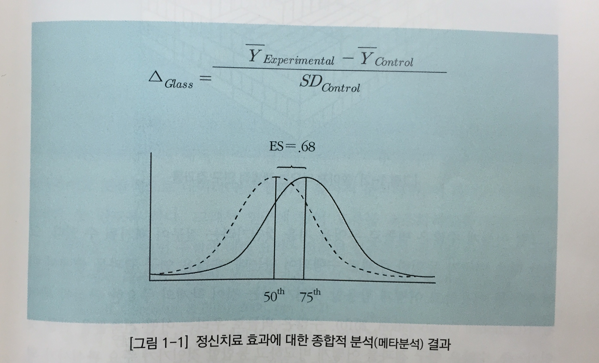

메타분석
========================================================

- 발표자 : 김무성
- 참고자료 1 : 알기쉬운 메타분석의 이해 / 황성동 
- 참고자료 2 : 응용데이터분석 1. 메타분석 "meta" / 허명회
- 참고자료 3 : Tutorial On Meta Analysis In R, R useR! Conference 2013 / Stephanie Kovalchik / http://www.edii.uclm.es/~useR-2013/Tutorials/kovalchik/kovalchik_meta_tutorial.pdf


# 참고자료 1 : 알기쉬운 메타분석의 이해

-----------------------------




# 참고자료 2 : 응용데이터분석 1. 메타분석 "meta"

# 1. 비율의 비교

```{r}
#install.packages("meta")
library(meta)
data(Fleiss93)
```
```{r}
# Fleiss93 자료의 7개 연구를 종합해보자. 처리와 대조 간 비교 지표로는
# 오즈비(OR)를 쓰기로 한다. 이 자료는 “meta” 팩키지 Fleiss93에 있다. 사용
# 할 함수는 metabin( )이다.
str(Fleiss93)
head(Fleiss93)

# 메타분석
# studlab :
#  ‘study label’을 의미한다.
# sm : 
#  처리와 대조의 비교에 사용될 요약측도(summary measure).
#  "RR", "OR", "RD", "AS" 중 하나를 지정한다.
# method :
#  개별연구의 결합 방법(method). 여기서 적용한 방법은 "inverse“
#  이다. 이것 외 "MH" (Mantel-Haenszel)와 "Peto"의 방법이 있다.
meta.1 <- metabin(event.e, n.e, event.c, n.c, studlab=paste(study, year), sm="OR", method="inverse", data=Fleiss93)

# 결과
meta.1
```
앞의 R 출력에서 첫 연구인 “MRC-1 1974”의 OR은 0.7197이다 (확인해볼 것).
이 값이 1보다 작으므로 처리(아스피린)가 대조(위약)에 비해 사건(심근경색증)의
발생률이 작게 나타났음을 알 수 있다. 이렇게 7개 개별연구를 결합한 결과로
얻은 OR(오즈 비)은 1) 고정효과 모형에서는 0.897이고 2) 임의효과 모형에서는
0.876이다. 개별 OR들의 결합에 쓰인 가중치는 1) 고정효과 모형에서는 0.028,
⋯ ,0.729 등이고 2) 임의효과 모형에서는 0.082, ⋯ ,0.358 등으로 임의효과 모
형 하에서 편차가 작다. 이 사례에서 수집된 개별 자료들은 지역과 연도 등에서
차이가 있으므로 임의효과 모형이 타당할 것이다.

```{r}
# 결과 시각화. 고정효과 모형의 출력은 억제되었다.
forest(meta.1, comb.fixed=FALSE, leftcols="studlab", rightcol=FALSE)
```

# 2. 출간 편향 

```{r}
funnel(meta.1)
```
플롯에서 오른쪽 아래 코너가 비어 있다. 이것은 표준오차(standard
error)가 작은 연구들은 OR이 평균보다 작은 것들만 수집되었음을 뜻한다.


# 3. 평균의 비교

```{r}
# Fleiss93cont 사례는 정신적 치료가 병원 이용(medical use)에 미치는
# 영향을 본 5개 개별연구의 리스트이다. 개별 사례는 처리 평균과 대조 평균으로
# 정리되었다.
data(Fleiss93cont)
str(Fleiss93cont)
head(Fleiss93cont)

# 메타분석
meta.2 <- metacont(n.e, mean.e, sd.e, n.c, mean.c, sd.c, sm="SMD", data=Fleiss93cont)
meta.2
```

Fleiss93cont 사례에서 종합된 SMD는 –0.343이다. 평균적으로 처리평균이 대
조평균에 비해 0.343 표준편차만큼 작다는 말인데, 이것은 처리의 효과로 표준정
규분포에서 0에 있던 중심이 하위 36.6% 분위수가 있는 z = -0.343으로 이동함
을 의미한다. 이 음의 차이(negative difference)는 통계적으로도 상당히 유의하
다 (단측 p-값 < 1%).


```{r}
# 결과 시각화. 고정효과 모형의 출력은 억제되었다.
forest(meta.2, comb.fixed=FALSE, leftcols="studlab", rightcol=FALSE)
# 2. 출간 편향 
funnel(meta.2)
```

-----------------------------

# 참고자료 3 : Tutorial On Meta Analysis In R

# Searching The Literature With R

## importing PubMed Data with RISmed

```{r}
#install.packages("RISmed")
library(RISmed)

# -- Impoting PubMed Data With RISmed
# The following code performs a PubMed query of all BMJ articles with "rofecoxib" in the title.
# refecoxib ? - https://www.google.co.kr/search?q=rofecoxib&newwindow=1&safe=off&tbm=isch&tbo=u&source=univ&sa=X&ei=nKx-VMVeheHwBe3zgtgM&ved=0CC8QsAQ&biw=832&bih=810
fit <- EUtilsSummary("rofecoxib[ti]+British Medical Journal[jo]", db = "pubmed")
QueryTranslation(fit) # Extract the translated query
QueryCount(fit) # Extract the number of matched records
fetch <- EUtilsGet(fit)
fetch # Medline Object
getSlots("Medline") # Available methods
ArticleTitle(fetch)[1:5]
Author(fetch)[[1]]
Year(fetch)
min(Year(fetch)) # Earliest year
ArticleTitle(fetch)[Year(fetch) == 2001] # Title of earliest record(s)
AuthorList <- Author(fetch) # Extract list of authors
LastFirst <- sapply(AuthorList, function(x) paste(x$LastName, x$ForeName))
sort(table(unlist(LastFirst)), dec = TRUE)[1:3] # Tabulate & Sort
```

# Basic Meta-Analysis in R

## R Packages For Standard Meta Analysis

 - meta (Author: Guido Schwarzer)
 - metafor (Author: Wolfgang Viechtbauer)
 - rmeta (Author: Thomas Lumley)

## Datasets For Package Examples

 - BCG vaccine trials (from metafor)
 - Amlodipine angina treatment trials (from meta)
 
## BCG Dataset

- Overview: 13 vaccine trials of Bacillus Calmette–Guérin (BCG)
- vaccine vs. no vaccine
- Treatment goal: Prevention of tuberculosis
- Primary endpoint: Tuberculosis infection
- Possible explanatory variables:
 - latitude of study region
 - treatment allocation method
 - year published
- BCG vaccine ? - http://www.paik.ac.kr/sanggye/medi/sub6_view.asp?p_seq=55&gotopage=1 

```{r}
#install.packages("metafor")
library(metafor) # Load package
data(dat.bcg) # BCG meta-analytic dataset
str(dat.bcg) # Describe meta-analysis structure
head(dat.bcg)
``` 

### Calculating : Log Odds Ratio
```{r}
Y <- with(dat.bcg, log(tpos * cneg/(tneg * cpos)))
V <- with(dat.bcg, 1/tpos + 1/cneg + 1/tneg + 1/cpos)
cbind(Y, V)
```

### Effect Size Calculation

```{r}
# escalc(endpoints, variances, measure, data, ...)
# endpoints: 
#   arguments or formula containing endpoint values
# variances: 
#   arguments containing endpoint variances
# measure: 
#   character value indicating type of ES
# data: 
#   data frame containing named variables
ES <- escalc(ai = tpos, bi = tneg, ci = cpos, di = cneg, data = dat.bcg, measure = "OR")
ES
# Effect Size : Log Odds Ratio
cbind(ES$yi, ES$vi)
```

```{r}
# Formula-Based Specification
# escalc(formula = outcome ~ group | study, data = data, weights = n)
library(reshape2) # Load package for data reshaping
head(dat.bcg)
bcg.long <- melt(dat.bcg[, c("trial", "tpos", "tneg", "cpos", "cneg")], id = "trial")
bcg.long
bcg.long$pos <- ifelse(bcg.long$var == "tpos" | bcg.long$var == "cpos", 1, 0)
bcg.long$group <- ifelse(bcg.long$var == "tpos" | bcg.long$var == "tneg", 1, 0)
bcg.long

# Cal ES
# output : yi = ESs, vi = variances
escalc(factor(pos) ~ factor(group) | factor(trial), weights = value, data = bcg.long, measure = "OR")

```

### Effects modeling (Fixed Effects? Random Effects?)

```{r}
# rma(yi, vi, method, ...)
# yi :
#   effect size
# vi :
#   variances
# method :
#   type of model approach
#   "FE" = Fixed Effects, "DL" = DerSimonian-Laird, "HE" = Hedges estimator, 
#   "ML" = Maximum Likelihood, "REML" = Restricted ML
```

#### BCG FE Model
```{r}
result.or <- rma(yi = Y, vi = V, method = "FE") # Log Odds Ratio
summary(result.or)

```

## amlodipine Dataset

- Overview: 8 randomized controlled trials (RCTs) of amlodipine vs.
placebo
- Treatment goal: Reduce harms of angina (chest pain)
- Primary endpoint: Work capacity (ratio of exercise time after to
before intervention)
- amlodipin ? - http://www.nhs.uk/medicine-guides/pages/MedicineOverview.aspx?condition=Angina&medicine=Amlodipine


```{r}
library(meta) # Load package
data(amlodipine) # amlodipine meta-analytic dataset
str(amlodipine) # Describe meta-analysis structure
head(amlodipine)
```

#### amlodipine FE Model, Mean Difference
```{r}
# Mean Difference
result.md <- rma(m1 = mean.amlo, m2 = mean.plac, sd1 = sqrt(var.amlo), sd2 = sqrt(var.plac), n1 = n.amlo, n2 = n.plac, method = "FE", measure = "MD", data = amlodipine)
summary(result.md)

# Study Contributions
contributions <- 1/result.md$vi/sum(1/result.md$vi) * 100
par(mar = c(5, 10, 5, 5))
barplot(contributions, names = amlodipine$study, xlim = c(0, 50), las = 2, horiz = T, col = "royalblue")
```

#### amlodipine RE Model, Mean Difference
```{r}
# Mean Difference
result.md <- rma(m1 = mean.amlo, m2 = mean.plac, sd1 = sqrt(var.amlo), sd2 = sqrt(var.plac), n1 = n.amlo, n2 = n.plac, method = "REML", measure = "MD", data = amlodipine)
summary(result.md)
```

# Visualizing Heterogeneity

## Forest Plot
```{r}
forest(result.md) # DEFAULT PLOT
```

```{r}
args(forest.rma)
```

## Customizing Forest Plot

```{r}
# Some typical modifications:
# order: 
#   Sort by "obs", "fit", "prec", etc.
# slab: 
#   Change study labels
# ilab: 
#   Add study information
# transf: 
#   Apply function to effects
# psize: 
#   Symbol sizes

study.names <- paste("Study", letters[1:8])
study.year <- 2000 + sample(0:9, 8, replace = T)

forest(result.md, order = "obs", slab = study.names, ilab = study.year, ilab.xpos = result.md$b - 1, refline = result.md$b)

# order by precision (BCG results)
forest(result.or, order = "prec", transf = exp, refline = 1)

```

# Publication Bias

## Funnel Plot
```{r}
funnel(result.md)
```


# Comparing metafor, rmeta, meta

http://www.edii.uclm.es/~useR-2013/Tutorials/kovalchik/kovalchik_meta_tutorial.pdf
