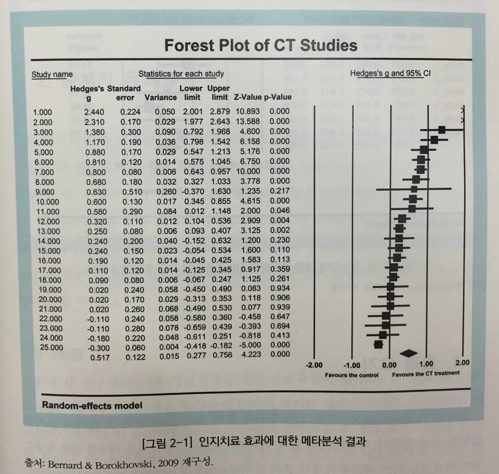
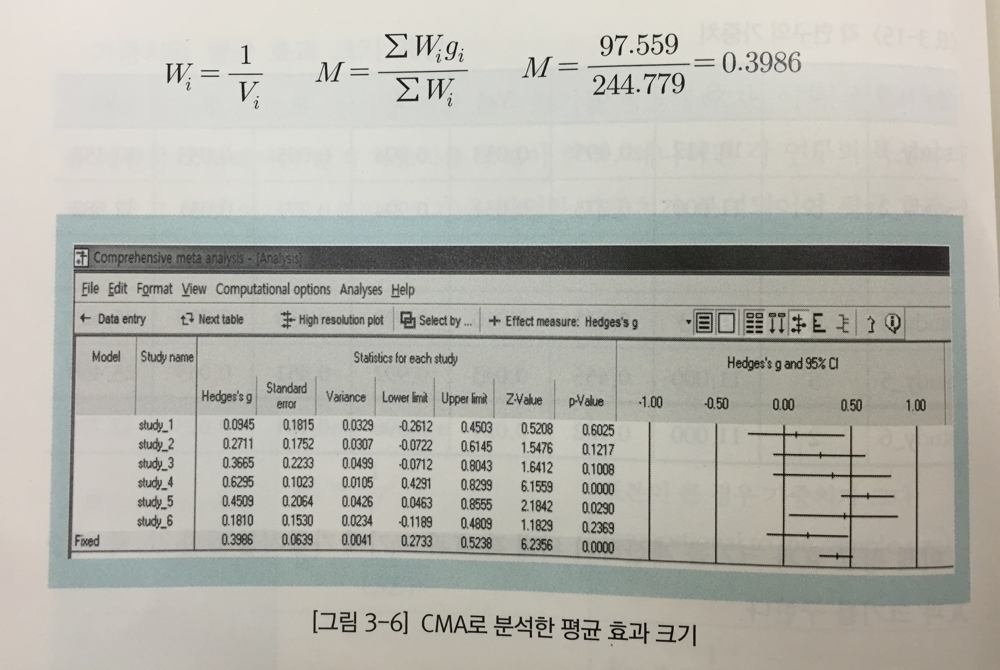

메타분석
========================================================

- 발표자 : 김무성
- 참고자료 1 : 알기쉬운 메타분석의 이해 / 황성동 
- 참고자료 2 : 응용데이터분석 1. 메타분석 "meta" / 허명회
- 참고자료 3 : Tutorial On Meta Analysis In R, R useR! Conference 2013 / Stephanie Kovalchik / http://www.edii.uclm.es/~useR-2013/Tutorials/kovalchik/kovalchik_meta_tutorial.pdf


# 참고자료 1 : 알기쉬운 메타분석의 이해

# 1. 메타분석의 배경

## 메타분석이란?


## 체계적 연구결과분석과 메타분석


## 근거기반실천과 메타분석


## 메타분석의 단계


-----------------------------

# 2. 메타분석에 대한 기본 이해

* 주요 용어
 - 효과 크기(effect size) : 표준화된 평균 차이(d), 상관관계(r), 승산비(OR) 등
 - 통계적 유의성 또는 정밀성(precision) : 신뢰구간(confidence interval) 또는 유의확률(p-values)
 - 가중치(weights)
 - 평균 효과 크기(summary effect size)





-----------------------------

# 3. 효과 크기

 * 효과 크기의 평균과 통계적 유의미성 확인
 * 효과 크기의 일관성 확인 및 동질성 검증
 * 효과 크기의 이질성에 대한 설명

## 효과 크기의 의미


## 효과 크기 유형


## 효과 크기 해석


## 효과 크기 계산 (연속형 데이터, "두 집단 사후검사 = 즉 통제집단후비교조사의 경우"" 예제)

 * 연속형 데이터의 효과 크기 계산
 * 두 집단(사후검사), 즉 통제집단후비교조사의 경우
 * step 
  - 1) 실험집단과 통제집단의 평균, 표준편차, 표본 크기
  - 2) 표준화된 평균 차이(d)
  - 3) 표준화된 평균 차이와 그 분산(V_d)
  - 4) 교정된 표준화된 평균 차이(g)
  - 5) 교정된 표준화된 평균 차이(g)와 그 분산(V_g)
  - 6) 효과 크기의 표준오차와 신뢰구간, 유의확률
  - 7) 가중치
  - 8) 가중 효과 크기
  - 9) 평균 효과 크기 
  - 10) 평균 효과 크기와 표준오차
  

### 1) 실험집단과 통제집단의 평균, 표준편차, 표본 크기


### 2) 표준화된 평균 차이(d) : Cohen's d (= Standardized mean difference)


### 3) 표준화된 평균 차이와 그 분산(V_d)


### 4) 교정된 표준화된 평균 차이(g) : Hedges's d


### 5) 교정된 표준화된 평균 차이(g)와 그 분산(V_g)


### 6) 효과 크기의 표준오차와 신뢰구간, 유의확률


### 7) 가중치


### 8) 가중 효과 크기


### 9) 평균 효과 크기 



### 10) 평균 효과 크기와 표준오차


### 효과 크기의 전환


-----------------------------

# 4. 고정효과모형과 무선효과모형

## 1. 고정효과모형과 무선효과모형의 의미


* 고정효과모형
 
 

* 무선효과모형

 


## 2. 고정효과모형과 무선효과모형의 차이


## 3. 고정효과모형과 무선효과모형의 적용 사례


### 고정효과모형과 무선효과모형의 특성 요약 비교


-----------------------------

# 9. 출간 오류 분석


## 출간 오류의 의미 

 * 출간된 연구의 결과가 모든 (수행된) 연구의 결과를 대표하지 못할 때.
  - 누락된 연구 문제
  - 포본 오류

## 출간 오류 분석 과정

 * 데이터에 대한 검토(forest plot) 
 * 오류의 존재 유무에 대한 확인(funnel plot 이용)
  - 비대칭에 대한 시각적 분석
  - 비대칭에 대한 통계적 분석
  
  
### 데이터에 대한 검토(forest plot) 

 


### 오류의 존재 유무에 대한 확인(funnel plot 이용)

 

 

 

  

-----------------------------

# 참고자료 2 : 응용데이터분석 1. 메타분석 "meta"

# 1. 비율의 비교


```r
#install.packages("meta")
library(meta)
```

```
## Loading 'meta' package (version 4.0-1).
```

```r
data(Fleiss93)
```

```r
# Fleiss93 자료의 7개 연구를 종합해보자. 처리와 대조 간 비교 지표로는
# 오즈비(OR)를 쓰기로 한다. 이 자료는 “meta” 팩키지 Fleiss93에 있다. 사용
# 할 함수는 metabin( )이다.
str(Fleiss93)
```

```
## 'data.frame':	7 obs. of  6 variables:
##  $ study  : Factor w/ 7 levels "AMIS","CDP","GASP",..: 5 2 6 3 7 1 4
##  $ year   : int  1974 1976 1979 1979 1980 1980 1988
##  $ event.e: int  49 44 102 32 85 246 1570
##  $ n.e    : int  615 758 832 317 810 2267 8587
##  $ event.c: int  67 64 126 38 52 219 1720
##  $ n.c    : int  624 771 850 309 406 2257 8600
```

```r
head(Fleiss93)
```

```
##   study year event.e  n.e event.c  n.c
## 1 MRC-1 1974      49  615      67  624
## 2   CDP 1976      44  758      64  771
## 3 MRC-2 1979     102  832     126  850
## 4  GASP 1979      32  317      38  309
## 5 PARIS 1980      85  810      52  406
## 6  AMIS 1980     246 2267     219 2257
```

```r
# 메타분석
# studlab :
#  ‘study label’을 의미한다.
# sm : 
#  처리와 대조의 비교에 사용될 요약측도(summary measure).
#  "RR", "OR", "RD", "AS" 중 하나를 지정한다.
# method :
#  개별연구의 결합 방법(method). 여기서 적용한 방법은 "inverse“
#  이다. 이것 외 "MH" (Mantel-Haenszel)와 "Peto"의 방법이 있다.
meta.1 <- metabin(event.e, n.e, event.c, n.c, studlab=paste(study, year), sm="OR", method="inverse", data=Fleiss93)

# 결과
meta.1
```

```
##                 OR           95%-CI %W(fixed) %W(random)
## MRC-1 1974  0.7197 [0.4890; 1.0593]      2.82       8.21
## CDP 1976    0.6808 [0.4574; 1.0132]      2.67       7.85
## MRC-2 1979  0.8029 [0.6065; 1.0629]      5.36      13.23
## GASP 1979   0.8007 [0.4863; 1.3186]      1.70       5.36
## PARIS 1980  0.7981 [0.5526; 1.1529]      3.12       8.89
## AMIS 1980   1.1327 [0.9347; 1.3728]     11.42      20.70
## ISIS-2 1988 0.8950 [0.8294; 0.9657]     72.91      35.77
## 
## Number of studies combined: k=7
## 
##                          OR           95%-CI      z  p-value
## Fixed effect model   0.8969 [0.8405; 0.9571] -3.283   0.001 
## Random effects model 0.8763 [0.7743; 0.9917] -2.092   0.0365
## 
## Quantifying heterogeneity:
## tau^2 = 0.0096; H = 1.29 [1; 1.99]; I^2 = 39.7% [0%; 74.6%]
## 
## Test of heterogeneity:
##     Q d.f.  p-value
##  9.95    6   0.1269
## 
## Details on meta-analytical method:
## - Inverse variance method
## - DerSimonian-Laird estimator for tau^2
```
앞의 R 출력에서 첫 연구인 “MRC-1 1974”의 OR은 0.7197이다 (확인해볼 것).
이 값이 1보다 작으므로 처리(아스피린)가 대조(위약)에 비해 사건(심근경색증)의
발생률이 작게 나타났음을 알 수 있다. 이렇게 7개 개별연구를 결합한 결과로
얻은 OR(오즈 비)은 1) 고정효과 모형에서는 0.897이고 2) 임의효과 모형에서는
0.876이다. 개별 OR들의 결합에 쓰인 가중치는 1) 고정효과 모형에서는 0.028,
⋯ ,0.729 등이고 2) 임의효과 모형에서는 0.082, ⋯ ,0.358 등으로 임의효과 모
형 하에서 편차가 작다. 이 사례에서 수집된 개별 자료들은 지역과 연도 등에서
차이가 있으므로 임의효과 모형이 타당할 것이다.


```r
# 결과 시각화. 고정효과 모형의 출력은 억제되었다.
forest(meta.1, comb.fixed=FALSE, leftcols="studlab", rightcol=FALSE)
```

 

-----------------------------

# 2. 출간 편향 


```r
funnel(meta.1)
```

 
플롯에서 오른쪽 아래 코너가 비어 있다. 이것은 표준오차(standard
error)가 작은 연구들은 OR이 평균보다 작은 것들만 수집되었음을 뜻한다.

-----------------------------

# 3. 평균의 비교


```r
# Fleiss93cont 사례는 정신적 치료가 병원 이용(medical use)에 미치는
# 영향을 본 5개 개별연구의 리스트이다. 개별 사례는 처리 평균과 대조 평균으로
# 정리되었다.
data(Fleiss93cont)
str(Fleiss93cont)
```

```
## 'data.frame':	5 obs. of  8 variables:
##  $ study : Factor w/ 5 levels "Davis","Florell",..: 1 2 3 4 5
##  $ year  : int  1973 1971 1975 1975 1977
##  $ n.e   : int  13 30 35 20 8
##  $ mean.e: num  5 4.9 22.5 12.5 6.5
##  $ sd.e  : num  4.7 1.71 3.44 1.47 0.76
##  $ n.c   : int  13 50 35 20 8
##  $ mean.c: num  6.5 6.1 24.9 12.3 7.38
##  $ sd.c  : num  3.8 2.3 10.65 1.66 1.41
```

```r
head(Fleiss93cont)
```

```
##     study year n.e mean.e sd.e n.c mean.c  sd.c
## 1   Davis 1973  13    5.0 4.70  13   6.50  3.80
## 2 Florell 1971  30    4.9 1.71  50   6.10  2.30
## 3   Gruen 1975  35   22.5 3.44  35  24.90 10.65
## 4    Hart 1975  20   12.5 1.47  20  12.30  1.66
## 5  Wilson 1977   8    6.5 0.76   8   7.38  1.41
```

```r
# 메타분석
meta.2 <- metacont(n.e, mean.e, sd.e, n.c, mean.c, sd.c, sm="SMD", data=Fleiss93cont)
meta.2
```

```
##       SMD             95%-CI %W(fixed) %W(random)
## 1 -0.3399 [-1.1152;  0.4354]     11.54      11.54
## 2 -0.5659 [-1.0274; -0.1044]     32.58      32.58
## 3 -0.2999 [-0.7712;  0.1714]     31.23      31.23
## 4  0.1250 [-0.4954;  0.7455]     18.02      18.02
## 5 -0.7346 [-1.7575;  0.2883]      6.63       6.63
## 
## Number of studies combined: k=5
## 
##                          SMD           95%-CI      z  p-value
## Fixed effect model   -0.3434 [-0.6068; -0.08] -2.555   0.0106
## Random effects model -0.3434 [-0.6068; -0.08] -2.555   0.0106
## 
## Quantifying heterogeneity:
## tau^2 = 0; H = 1 [1; 2.1]; I^2 = 0% [0%; 77.4%]
## 
## Test of heterogeneity:
##     Q d.f.  p-value
##  3.68    4   0.4515
## 
## Details on meta-analytical method:
## - Inverse variance method
## - DerSimonian-Laird estimator for tau^2
```

Fleiss93cont 사례에서 종합된 SMD는 –0.343이다. 평균적으로 처리평균이 대
조평균에 비해 0.343 표준편차만큼 작다는 말인데, 이것은 처리의 효과로 표준정
규분포에서 0에 있던 중심이 하위 36.6% 분위수가 있는 z = -0.343으로 이동함
을 의미한다. 이 음의 차이(negative difference)는 통계적으로도 상당히 유의하
다 (단측 p-값 < 1%).


```r
# 결과 시각화. 고정효과 모형의 출력은 억제되었다.
forest(meta.2, comb.fixed=FALSE, leftcols="studlab", rightcol=FALSE)
```

 

```r
# 2. 출간 편향 
funnel(meta.2)
```

 

-----------------------------

# 참고자료 3 : Tutorial On Meta Analysis In R

# Searching The Literature With R

## importing PubMed Data with RISmed


```r
#install.packages("RISmed")
library(RISmed)

# -- Impoting PubMed Data With RISmed
# The following code performs a PubMed query of all BMJ articles with "rofecoxib" in the title.
# refecoxib ? - https://www.google.co.kr/search?q=rofecoxib&newwindow=1&safe=off&tbm=isch&tbo=u&source=univ&sa=X&ei=nKx-VMVeheHwBe3zgtgM&ved=0CC8QsAQ&biw=832&bih=810
fit <- EUtilsSummary("rofecoxib[ti]+British Medical Journal[jo]", db = "pubmed")
QueryTranslation(fit) # Extract the translated query
```

```
## [1] "rofecoxib[ti] AND (\"Br Med J\"[Journal] OR \"Br Med J (Clin Res Ed)\"[Journal] OR \"BMJ\"[Journal])"
```

```r
QueryCount(fit) # Extract the number of matched records
```

```
## [1] 16
```

```r
fetch <- EUtilsGet(fit)
fetch # Medline Object
```

```
## PubMed query:  rofecoxib[ti] AND ("Br Med J"[Journal] OR "Br Med J (Clin Res Ed)"[Journal] OR "BMJ"[Journal]) 
## 
## Records:  16
```

```r
getSlots("Medline") # Available methods
```

```
##                Query                 PMID                 Year 
##          "character"          "character"            "numeric" 
##                Month                  Day               Author 
##            "numeric"            "numeric"               "list" 
##                 ISSN                Title         ArticleTitle 
##          "character"          "character"          "character" 
##          ELocationID         AbstractText          Affiliation 
##          "character"          "character"          "character" 
##             Language      PublicationType            MedlineTA 
##          "character"          "character"          "character" 
##          NlmUniqueID          ISSNLinking                 Hour 
##          "character"          "character"            "numeric" 
##               Minute    PublicationStatus            ArticleId 
##            "numeric"          "character"          "character" 
##               Volume                Issue      ISOAbbreviation 
##          "character"          "character"          "character" 
##           MedlinePgn CopyrightInformation              Country 
##          "character"          "character"          "character" 
##              GrantID              Acronym               Agency 
##          "character"          "character"          "character" 
##       RegistryNumber            RefSource       CollectiveName 
##          "character"          "character"          "character" 
##                 Mesh 
##               "list"
```

```r
ArticleTitle(fetch)[1:5]
```

```
## [1] "Merck pays $1bn penalty in relation to promotion of rofecoxib."      
## [2] "Merck to pay $58m in settlement over rofecoxib advertising."         
## [3] "94% of patients suing Merck over rofecoxib agree to company's offer."
## [4] "Merck to pay $5bn in rofecoxib claims."                              
## [5] "Merck appeals rofecoxib verdict."
```

```r
Author(fetch)[[1]]
```

```
##   LastName       ForeName Initials order
## 1    Tanne Janice Hopkins       JH     1
```

```r
Year(fetch)
```

```
##  [1] 2011 2008 2008 2007 2007 2006 2005 2005 2004 2004 2004 2004 2004 2003
## [15] 2002 2001
```

```r
min(Year(fetch)) # Earliest year
```

```
## [1] 2001
```

```r
ArticleTitle(fetch)[Year(fetch) == 2001] # Title of earliest record(s)
```

```
## [1] "FDA warns Merck over its promotion of rofecoxib."
```

```r
AuthorList <- Author(fetch) # Extract list of authors
LastFirst <- sapply(AuthorList, function(x) paste(x$LastName, x$ForeName))
sort(table(unlist(LastFirst)), dec = TRUE)[1:3] # Tabulate & Sort
```

```
## 
## Tanne Janice Hopkins        Charatan Fred      Abenhaim Lucien 
##                    4                    3                    1
```

-----------------------------

# Basic Meta-Analysis in R

## R Packages For Standard Meta Analysis

 - meta (Author: Guido Schwarzer)
 - metafor (Author: Wolfgang Viechtbauer)
 - rmeta (Author: Thomas Lumley)

## Datasets For Package Examples

 - BCG vaccine trials (from metafor)
 - Amlodipine angina treatment trials (from meta)
 
## BCG Dataset

- Overview: 13 vaccine trials of Bacillus Calmette–Guérin (BCG)
- vaccine vs. no vaccine
- Treatment goal: Prevention of tuberculosis
- Primary endpoint: Tuberculosis infection
- Possible explanatory variables:
 - latitude of study region
 - treatment allocation method
 - year published
- BCG vaccine ? - http://www.paik.ac.kr/sanggye/medi/sub6_view.asp?p_seq=55&gotopage=1 


```r
#install.packages("metafor")
library(metafor) # Load package
```

```
## Loading 'metafor' package (version 1.9-5). For an overview 
## and introduction to the package please type: help(metafor).
## 
## Attaching package: 'metafor'
## 
## The following objects are masked from 'package:meta':
## 
##     baujat, forest, funnel, labbe, radial, trimfill
```

```r
data(dat.bcg) # BCG meta-analytic dataset
str(dat.bcg) # Describe meta-analysis structure
```

```
## 'data.frame':	13 obs. of  9 variables:
##  $ trial : int  1 2 3 4 5 6 7 8 9 10 ...
##  $ author: chr  "Aronson" "Ferguson & Simes" "Rosenthal et al" "Hart & Sutherland" ...
##  $ year  : int  1948 1949 1960 1977 1973 1953 1973 1980 1968 1961 ...
##  $ tpos  : int  4 6 3 62 33 180 8 505 29 17 ...
##  $ tneg  : int  119 300 228 13536 5036 1361 2537 87886 7470 1699 ...
##  $ cpos  : int  11 29 11 248 47 372 10 499 45 65 ...
##  $ cneg  : int  128 274 209 12619 5761 1079 619 87892 7232 1600 ...
##  $ ablat : int  44 55 42 52 13 44 19 13 27 42 ...
##  $ alloc : chr  "random" "random" "random" "random" ...
```

```r
head(dat.bcg)
```

```
##   trial               author year tpos  tneg cpos  cneg ablat     alloc
## 1     1              Aronson 1948    4   119   11   128    44    random
## 2     2     Ferguson & Simes 1949    6   300   29   274    55    random
## 3     3      Rosenthal et al 1960    3   228   11   209    42    random
## 4     4    Hart & Sutherland 1977   62 13536  248 12619    52    random
## 5     5 Frimodt-Moller et al 1973   33  5036   47  5761    13 alternate
## 6     6      Stein & Aronson 1953  180  1361  372  1079    44 alternate
```

### Calculating : Log Odds Ratio

```r
Y <- with(dat.bcg, log(tpos * cneg/(tneg * cpos)))
V <- with(dat.bcg, 1/tpos + 1/cneg + 1/tneg + 1/cpos)
cbind(Y, V)
```

```
##              Y        V
##  [1,] -0.93869 0.357125
##  [2,] -1.66619 0.208132
##  [3,] -1.38629 0.433413
##  [4,] -1.45644 0.020314
##  [5,] -0.21914 0.051952
##  [6,] -0.95812 0.009905
##  [7,] -1.63378 0.227010
##  [8,]  0.01202 0.004007
##  [9,] -0.47175 0.056977
## [10,] -1.40121 0.075422
## [11,] -0.34085 0.012525
## [12,]  0.44663 0.534162
## [13,] -0.01734 0.071635
```

### Effect Size Calculation


```r
# escalc(endpoints, variances, measure, data, ...)
# endpoints: 
#   arguments or formula containing endpoint values
# variances: 
#   arguments containing endpoint variances
# measure: 
#   character value indicating type of ES
# data: 
#   data frame containing named variables
ES <- escalc(ai = tpos, bi = tneg, ci = cpos, di = cneg, data = dat.bcg, measure = "OR")
ES
```

```
##    trial               author year tpos  tneg cpos  cneg ablat      alloc
## 1      1              Aronson 1948    4   119   11   128    44     random
## 2      2     Ferguson & Simes 1949    6   300   29   274    55     random
## 3      3      Rosenthal et al 1960    3   228   11   209    42     random
## 4      4    Hart & Sutherland 1977   62 13536  248 12619    52     random
## 5      5 Frimodt-Moller et al 1973   33  5036   47  5761    13  alternate
## 6      6      Stein & Aronson 1953  180  1361  372  1079    44  alternate
## 7      7     Vandiviere et al 1973    8  2537   10   619    19     random
## 8      8           TPT Madras 1980  505 87886  499 87892    13     random
## 9      9     Coetzee & Berjak 1968   29  7470   45  7232    27     random
## 10    10      Rosenthal et al 1961   17  1699   65  1600    42 systematic
## 11    11       Comstock et al 1974  186 50448  141 27197    18 systematic
## 12    12   Comstock & Webster 1969    5  2493    3  2338    33 systematic
## 13    13       Comstock et al 1976   27 16886   29 17825    33 systematic
##         yi     vi
## 1  -0.9387 0.3571
## 2  -1.6662 0.2081
## 3  -1.3863 0.4334
## 4  -1.4564 0.0203
## 5  -0.2191 0.0520
## 6  -0.9581 0.0099
## 7  -1.6338 0.2270
## 8   0.0120 0.0040
## 9  -0.4717 0.0570
## 10 -1.4012 0.0754
## 11 -0.3408 0.0125
## 12  0.4466 0.5342
## 13 -0.0173 0.0716
```

```r
# Effect Size : Log Odds Ratio
cbind(ES$yi, ES$vi)
```

```
##           [,1]     [,2]
##  [1,] -0.93869 0.357125
##  [2,] -1.66619 0.208132
##  [3,] -1.38629 0.433413
##  [4,] -1.45644 0.020314
##  [5,] -0.21914 0.051952
##  [6,] -0.95812 0.009905
##  [7,] -1.63378 0.227010
##  [8,]  0.01202 0.004007
##  [9,] -0.47175 0.056977
## [10,] -1.40121 0.075422
## [11,] -0.34085 0.012525
## [12,]  0.44663 0.534162
## [13,] -0.01734 0.071635
```


```r
# Formula-Based Specification
# escalc(formula = outcome ~ group | study, data = data, weights = n)
library(reshape2) # Load package for data reshaping
head(dat.bcg)
```

```
##   trial               author year tpos  tneg cpos  cneg ablat     alloc
## 1     1              Aronson 1948    4   119   11   128    44    random
## 2     2     Ferguson & Simes 1949    6   300   29   274    55    random
## 3     3      Rosenthal et al 1960    3   228   11   209    42    random
## 4     4    Hart & Sutherland 1977   62 13536  248 12619    52    random
## 5     5 Frimodt-Moller et al 1973   33  5036   47  5761    13 alternate
## 6     6      Stein & Aronson 1953  180  1361  372  1079    44 alternate
```

```r
bcg.long <- melt(dat.bcg[, c("trial", "tpos", "tneg", "cpos", "cneg")], id = "trial")
bcg.long
```

```
##    trial variable value
## 1      1     tpos     4
## 2      2     tpos     6
## 3      3     tpos     3
## 4      4     tpos    62
## 5      5     tpos    33
## 6      6     tpos   180
## 7      7     tpos     8
## 8      8     tpos   505
## 9      9     tpos    29
## 10    10     tpos    17
## 11    11     tpos   186
## 12    12     tpos     5
## 13    13     tpos    27
## 14     1     tneg   119
## 15     2     tneg   300
## 16     3     tneg   228
## 17     4     tneg 13536
## 18     5     tneg  5036
## 19     6     tneg  1361
## 20     7     tneg  2537
## 21     8     tneg 87886
## 22     9     tneg  7470
## 23    10     tneg  1699
## 24    11     tneg 50448
## 25    12     tneg  2493
## 26    13     tneg 16886
## 27     1     cpos    11
## 28     2     cpos    29
## 29     3     cpos    11
## 30     4     cpos   248
## 31     5     cpos    47
## 32     6     cpos   372
## 33     7     cpos    10
## 34     8     cpos   499
## 35     9     cpos    45
## 36    10     cpos    65
## 37    11     cpos   141
## 38    12     cpos     3
## 39    13     cpos    29
## 40     1     cneg   128
## 41     2     cneg   274
## 42     3     cneg   209
## 43     4     cneg 12619
## 44     5     cneg  5761
## 45     6     cneg  1079
## 46     7     cneg   619
## 47     8     cneg 87892
## 48     9     cneg  7232
## 49    10     cneg  1600
## 50    11     cneg 27197
## 51    12     cneg  2338
## 52    13     cneg 17825
```

```r
bcg.long$pos <- ifelse(bcg.long$var == "tpos" | bcg.long$var == "cpos", 1, 0)
bcg.long$group <- ifelse(bcg.long$var == "tpos" | bcg.long$var == "tneg", 1, 0)
bcg.long
```

```
##    trial variable value pos group
## 1      1     tpos     4   1     1
## 2      2     tpos     6   1     1
## 3      3     tpos     3   1     1
## 4      4     tpos    62   1     1
## 5      5     tpos    33   1     1
## 6      6     tpos   180   1     1
## 7      7     tpos     8   1     1
## 8      8     tpos   505   1     1
## 9      9     tpos    29   1     1
## 10    10     tpos    17   1     1
## 11    11     tpos   186   1     1
## 12    12     tpos     5   1     1
## 13    13     tpos    27   1     1
## 14     1     tneg   119   0     1
## 15     2     tneg   300   0     1
## 16     3     tneg   228   0     1
## 17     4     tneg 13536   0     1
## 18     5     tneg  5036   0     1
## 19     6     tneg  1361   0     1
## 20     7     tneg  2537   0     1
## 21     8     tneg 87886   0     1
## 22     9     tneg  7470   0     1
## 23    10     tneg  1699   0     1
## 24    11     tneg 50448   0     1
## 25    12     tneg  2493   0     1
## 26    13     tneg 16886   0     1
## 27     1     cpos    11   1     0
## 28     2     cpos    29   1     0
## 29     3     cpos    11   1     0
## 30     4     cpos   248   1     0
## 31     5     cpos    47   1     0
## 32     6     cpos   372   1     0
## 33     7     cpos    10   1     0
## 34     8     cpos   499   1     0
## 35     9     cpos    45   1     0
## 36    10     cpos    65   1     0
## 37    11     cpos   141   1     0
## 38    12     cpos     3   1     0
## 39    13     cpos    29   1     0
## 40     1     cneg   128   0     0
## 41     2     cneg   274   0     0
## 42     3     cneg   209   0     0
## 43     4     cneg 12619   0     0
## 44     5     cneg  5761   0     0
## 45     6     cneg  1079   0     0
## 46     7     cneg   619   0     0
## 47     8     cneg 87892   0     0
## 48     9     cneg  7232   0     0
## 49    10     cneg  1600   0     0
## 50    11     cneg 27197   0     0
## 51    12     cneg  2338   0     0
## 52    13     cneg 17825   0     0
```

```r
# Cal ES
# output : yi = ESs, vi = variances
escalc(factor(pos) ~ factor(group) | factor(trial), weights = value, data = bcg.long, measure = "OR")
```

```
## Loading required namespace: Formula
```

```
##         yi     vi
## 1  -0.9387 0.3571
## 2  -1.6662 0.2081
## 3  -1.3863 0.4334
## 4  -1.4564 0.0203
## 5  -0.2191 0.0520
## 6  -0.9581 0.0099
## 7  -1.6338 0.2270
## 8   0.0120 0.0040
## 9  -0.4717 0.0570
## 10 -1.4012 0.0754
## 11 -0.3408 0.0125
## 12  0.4466 0.5342
## 13 -0.0173 0.0716
```

### Effects modeling (Fixed Effects? Random Effects?)


```r
# rma(yi, vi, method, ...)
# yi :
#   effect size
# vi :
#   variances
# method :
#   type of model approach
#   "FE" = Fixed Effects, "DL" = DerSimonian-Laird, "HE" = Hedges estimator, 
#   "ML" = Maximum Likelihood, "REML" = Restricted ML
```

#### BCG FE Model

```r
result.or <- rma(yi = Y, vi = V, method = "FE") # Log Odds Ratio
summary(result.or)
```

```
## 
## Fixed-Effects Model (k = 13)
## 
##   logLik  deviance       AIC       BIC      AICc  
## -76.0290  163.1649  154.0580  154.6229  154.4216  
## 
## Test for Heterogeneity: 
## Q(df = 12) = 163.1649, p-val < .0001
## 
## Model Results:
## 
## estimate       se     zval     pval    ci.lb    ci.ub          
##  -0.4361   0.0423 -10.3190   <.0001  -0.5190  -0.3533      *** 
## 
## ---
## Signif. codes:  0 '***' 0.001 '**' 0.01 '*' 0.05 '.' 0.1 ' ' 1
```

## amlodipine Dataset

- Overview: 8 randomized controlled trials (RCTs) of amlodipine vs.
placebo
- Treatment goal: Reduce harms of angina (chest pain)
- Primary endpoint: Work capacity (ratio of exercise time after to
before intervention)
- amlodipin ? - http://www.nhs.uk/medicine-guides/pages/MedicineOverview.aspx?condition=Angina&medicine=Amlodipine


```r
library(meta) # Load package
data(amlodipine) # amlodipine meta-analytic dataset
str(amlodipine) # Describe meta-analysis structure
```

```
## 'data.frame':	8 obs. of  7 variables:
##  $ study    : Factor w/ 8 levels "Protocol 154",..: 1 2 3 4 5 6 7 8
##  $ n.amlo   : int  46 30 75 12 32 31 27 46
##  $ mean.amlo: num  0.232 0.281 0.189 0.093 0.162 ...
##  $ var.amlo : num  0.2254 0.1441 0.1981 0.1389 0.0961 ...
##  $ n.plac   : int  48 26 72 12 34 31 27 47
##  $ mean.plac: num  -0.0027 0.027 0.0443 0.2277 0.0056 ...
##  $ var.plac : num  0.0007 0.1139 0.4972 0.0488 0.0955 ...
```

```r
head(amlodipine)
```

```
##           study n.amlo mean.amlo var.amlo n.plac mean.plac var.plac
## 1  Protocol 154     46    0.2316   0.2254     48   -0.0027   0.0007
## 2  Protocol 156     30    0.2811   0.1441     26    0.0270   0.1139
## 3  Protocol 157     75    0.1894   0.1981     72    0.0443   0.4972
## 4 Protocol 162A     12    0.0930   0.1389     12    0.2277   0.0488
## 5  Protocol 163     32    0.1622   0.0961     34    0.0056   0.0955
## 6  Protocol 166     31    0.1837   0.1246     31    0.0943   0.1734
```

#### amlodipine FE Model, Mean Difference

```r
# Mean Difference
result.md <- rma(m1 = mean.amlo, m2 = mean.plac, sd1 = sqrt(var.amlo), sd2 = sqrt(var.plac), n1 = n.amlo, n2 = n.plac, method = "FE", measure = "MD", data = amlodipine)
summary(result.md)
```

```
## 
## Fixed-Effects Model (k = 8)
## 
##   logLik  deviance       AIC       BIC      AICc  
##   4.7834   12.3311   -7.5669   -7.4874   -6.9002  
## 
## Test for Heterogeneity: 
## Q(df = 7) = 12.3311, p-val = 0.0902
## 
## Model Results:
## 
## estimate       se     zval     pval    ci.lb    ci.ub          
##   0.1619   0.0323   5.0134   <.0001   0.0986   0.2252      *** 
## 
## ---
## Signif. codes:  0 '***' 0.001 '**' 0.01 '*' 0.05 '.' 0.1 ' ' 1
```

```r
# Study Contributions
contributions <- 1/result.md$vi/sum(1/result.md$vi) * 100
par(mar = c(5, 10, 5, 5))
barplot(contributions, names = amlodipine$study, xlim = c(0, 50), las = 2, horiz = T, col = "royalblue")
```

 

#### amlodipine RE Model, Mean Difference

```r
# Mean Difference
result.md <- rma(m1 = mean.amlo, m2 = mean.plac, sd1 = sqrt(var.amlo), sd2 = sqrt(var.plac), n1 = n.amlo, n2 = n.plac, method = "REML", measure = "MD", data = amlodipine)
summary(result.md)
```

```
## 
## Random-Effects Model (k = 8; tau^2 estimator: REML)
## 
##   logLik  deviance       AIC       BIC      AICc  
##   3.3094   -6.6188   -2.6188   -2.7270    0.3812  
## 
## tau^2 (estimated amount of total heterogeneity): 0.0001 (SE = 0.0042)
## tau (square root of estimated tau^2 value):      0.0116
## I^2 (total heterogeneity / total variability):   1.54%
## H^2 (total variability / sampling variability):  1.02
## 
## Test for Heterogeneity: 
## Q(df = 7) = 12.3311, p-val = 0.0902
## 
## Model Results:
## 
## estimate       se     zval     pval    ci.lb    ci.ub          
##   0.1617   0.0326   4.9584   <.0001   0.0978   0.2257      *** 
## 
## ---
## Signif. codes:  0 '***' 0.001 '**' 0.01 '*' 0.05 '.' 0.1 ' ' 1
```

-----------------------------

# Visualizing Heterogeneity

## Forest Plot

```r
forest(result.md) # DEFAULT PLOT
```

 


```r
args(forest.rma)
```

```
## function (x, annotate = TRUE, addfit = TRUE, addcred = FALSE, 
##     showweights = FALSE, xlim, alim, clim, ylim, at, steps = 5, 
##     level = x$level, digits = 2, refline = 0, xlab, slab, mlab, 
##     ilab, ilab.xpos, ilab.pos, order, transf, atransf, targs, 
##     rows, efac = 1, pch = 15, psize, col, border, lty, cex, cex.lab, 
##     cex.axis, ...) 
## NULL
```

## Customizing Forest Plot


```r
# Some typical modifications:
# order: 
#   Sort by "obs", "fit", "prec", etc.
# slab: 
#   Change study labels
# ilab: 
#   Add study information
# transf: 
#   Apply function to effects
# psize: 
#   Symbol sizes

study.names <- paste("Study", letters[1:8])
study.year <- 2000 + sample(0:9, 8, replace = T)

forest(result.md, order = "obs", slab = study.names, ilab = study.year, ilab.xpos = result.md$b - 1, refline = result.md$b)
```

 

```r
# order by precision (BCG results)
forest(result.or, order = "prec", transf = exp, refline = 1)
```

 

-----------------------------

# Publication Bias

## Funnel Plot

```r
funnel(result.md)
```

 

-----------------------------

# Comparing metafor, rmeta, meta

http://www.edii.uclm.es/~useR-2013/Tutorials/kovalchik/kovalchik_meta_tutorial.pdf
